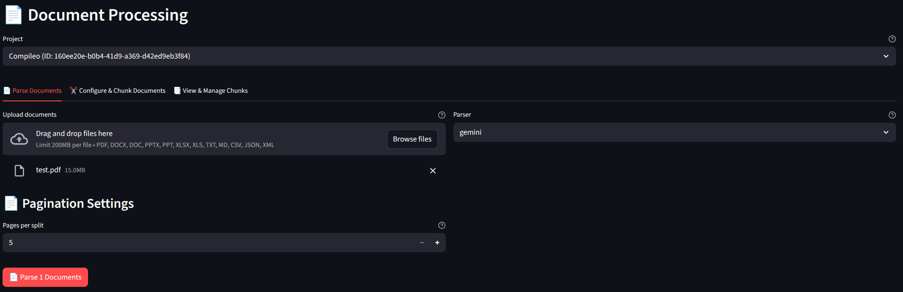
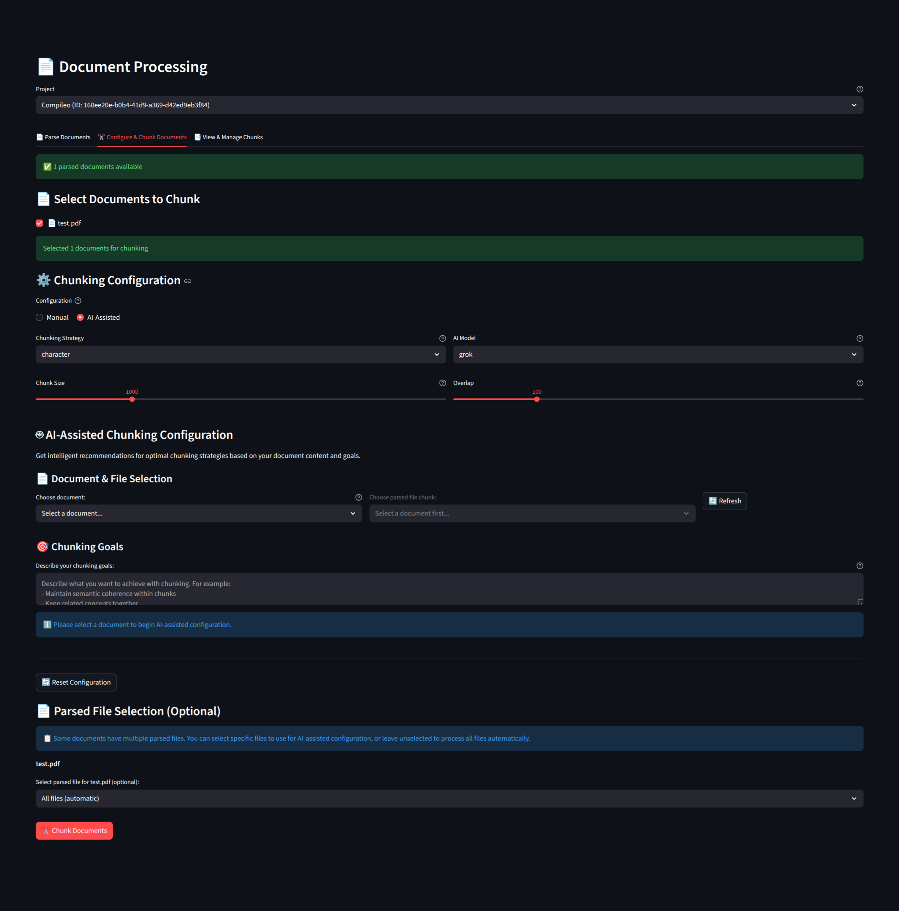
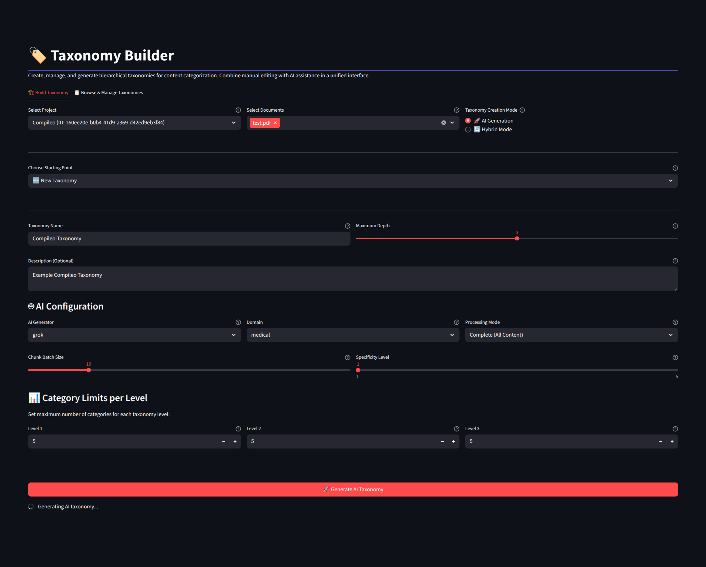
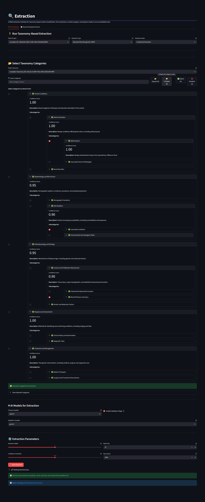
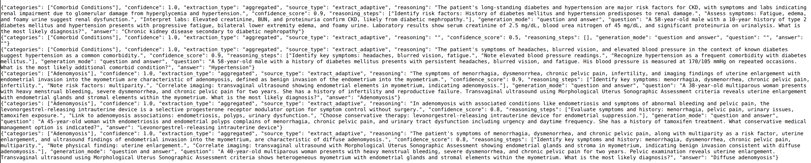
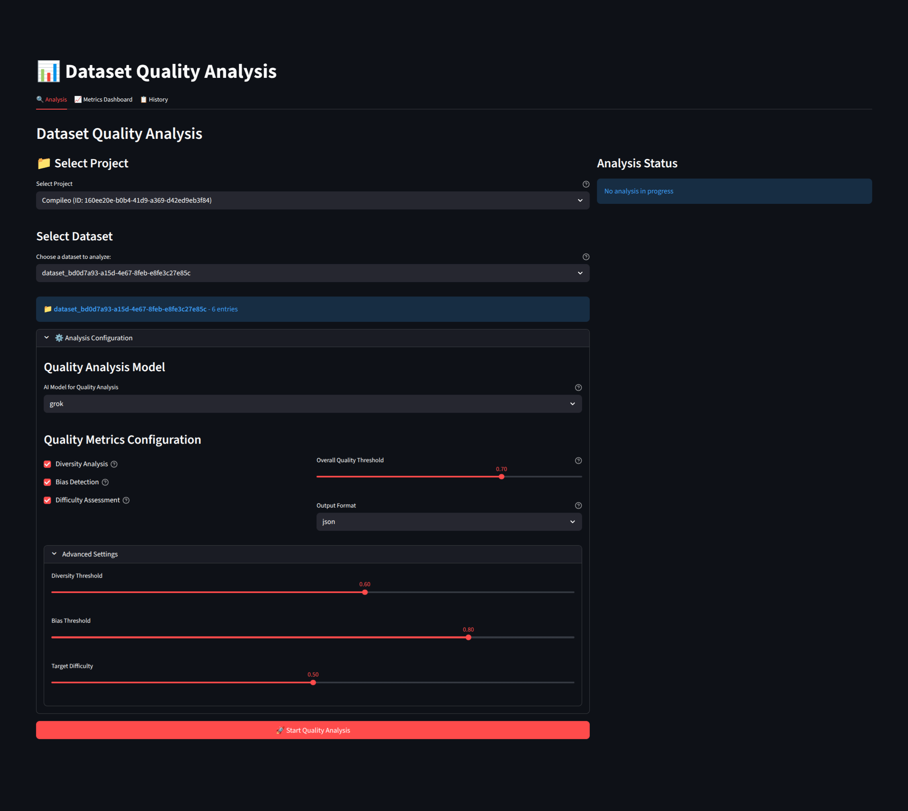
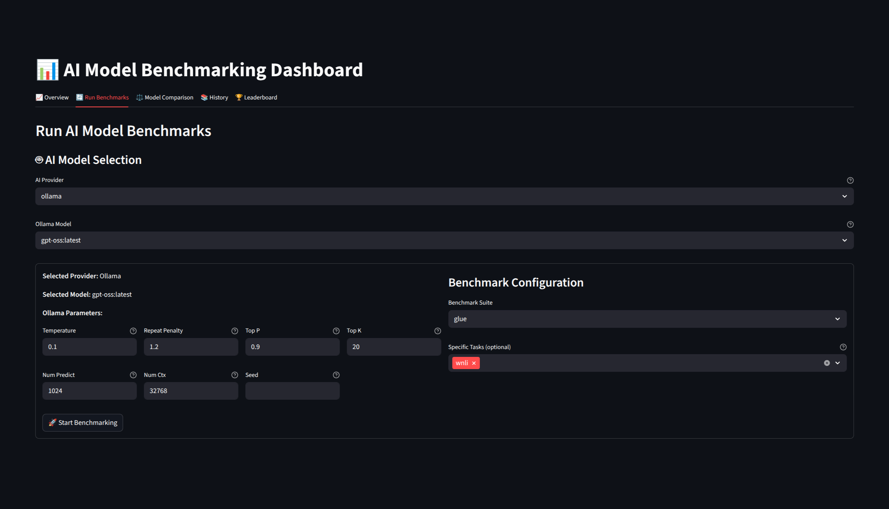
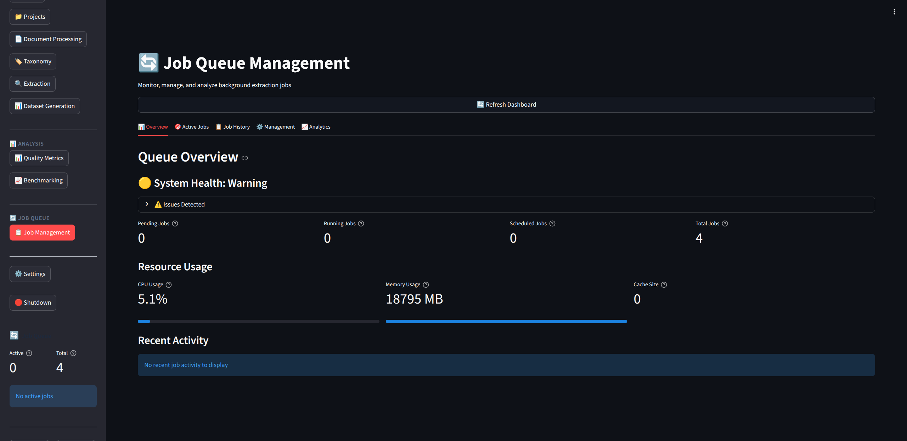

# 🔬 Compileo: The Ultimate AI-Powered Document Processing & Dataset Engineering Suite

**Compileo** is an enterprise-grade, modular platform designed to transform raw, unstructured data into high-quality, structured intelligence. Whether you're processing 1,000-page medical PDFs, scraping JavaScript-heavy websites, or engineering datasets for LLM fine-tuning and personal study, Compileo provides a unified, AI-driven lifecycle for the modern data era.

---

## 🌟 What can Compileo do?

Compileo isn't just a parser—it's a comprehensive **data engineering ecosystem**. It automates the complex journey from "Messy Source" to Validated, Categorized Intelligence."

### 📖 Multi-Source Knowledge Consolidation
Imagine you have several thick textbooks and want to create a specialized dataset focused only on **disease treatments**. Compileo can:
1.  **Ingest** all books simultaneously (PDF, DOCX, etc.).
2.  **Discover** a unified "Treatment" taxonomy across all sources automatically.
3.  **Extract** every mention of treatments, dosages, and contraindications with high precision.
4.  **Consolidate** this into one unified, high-quality Q&A dataset for training or study.

### 🕹️ Three Ways to Work
Compileo is designed for every workflow:
*   **Web GUI**: A user-friendly Streamlit interface with a 7-step guided wizard.
*   **REST API**: Seamlessly integrate dataset generation into your own applications.
*   **CLI**: Automate heavy-duty processing with powerful command-line parameters.

---

## 🚀  Features

### 📄 Intelligent Document Processing & AI-Assisted Chunking
*   **Massive PDF Autonomy**: Automatically splits 1,000+ page documents into manageable segments with **semantic overlaps**, ensuring LLM token limits are never hit while preserving context.
*   **Two-Pass VLM Parsing**: Employs a "Skim and Extract" methodology using Vision-Language Models (Grok, Gemini, Ollama) to first understand document layout and then extract high-fidelity Markdown.

<div align="center">
  <a href="img/DocumentProcessing.png"></a>
  <p><i>Intelligent Document Processing Workflow</i></p>
</div>

*   **AI-Assisted Strategy Recommendation**: Don't guess how to split your data. Describe your goal (e.g., *"I want to extract detailed surgical procedures"*), and Compileo's AI will analyze your documents to recommend the optimal **Semantic**, **Token**, or **Schema-based** chunking strategy.

<div align="center">
  <a href="img/chunking_AIassist.png"></a>
  <p><i>AI-Assisted Chunking Interface</i></p>
</div>

### 🧠 Semantic Data Engineering
*   **AI-Assisted Taxonomy**: Don't waste weeks defining categories. Compileo's **Smart Sampling** selects representative content to suggest and build hierarchical knowledge trees automatically.

<div align="center">
  <a href="img/Taxonomy_generating.png"></a>
  <p><i>AI-Assisted Taxonomy Generation</i></p>
</div>

*   **Multi-Stage Extraction**: Performs **Hierarchical Classification**, moving from coarse-grained categories to fine-grained entities based on your custom or generated taxonomy.

<div align="center">
  <a href="img/Extraction_main.png"></a>
  <p><i>Multi-Stage Entity Extraction</i></p>
</div>

*   **Dataset Engineering**: Transform extracted entities into high-quality datasets for RAG or fine-tuning.

<div align="center">
  <a href="img/dataset_example.png"></a>
  <p><i>Generated Dataset Preview</i></p>
</div>

### 🧪 Advanced Quality Control & Evaluation
*   **AI Confidence Scoring**: Every extracted entity and relationship is assigned an **AI confidence level** (0.0 - 1.0), allowing you to filter for only the most reliable data.
*   **Deep Quality Metrics**: Automated scoring for **Lexical Diversity**, **Demographic Bias**, **Answer Coherence**, and **Target Audience Alignment** via the `datasetqual` module.

<div align="center">
  <a href="img/datasetqual.png"></a>
  <p><i>Dataset Quality Evaluation Dashboard</i></p>
</div>

*   **Fine-Tuned Model Testing**: Use the `benchmarking` module to evaluate how your **fine-tuned models** perform on your custom datasets using industry-standard metrics (Accuracy, F1, BLEU, ROUGE).

<div align="center">
  <a href="img/benchmark.png"></a>
  <p><i>Model Performance Benchmarking</i></p>
</div>

### ⚡ High-Concurrency Job Management
*   **Asynchronous Processing**: All heavy-duty tasks are handled by a robust **Redis-backed queue (RQ)**, allowing for background processing without blocking the API or GUI.

<div align="center">
  <a href="img/jobhandle.png"></a>
  <p><i>Asynchronous Job Management</i></p>
</div>

### 🔌 Developer Extensibility
*   **Robust Plugin System**: Effortlessly extend Compileo by adding custom **Ingestion Handlers**, **Dataset Formatters**, or **API Routers** via a simple `.zip` package architecture.
*   **Custom Exports**: Out-of-the-box support for **Anki** export, allowing you to turn any technical document into a high-quality study deck.

---

## 💻 System Requirements

*   **CPU**: 4-core processor minimum (8-core recommended).
*   **RAM**: 8GB minimum (16GB recommended for heavy processing).
*   **GPU (Optional)**: NVIDIA GPU with 8GB+ VRAM. Required for **HuggingFace** local inference and advanced system performance monitoring.
*   **Storage**: 25GB free disk space.
*   **Operating System**: Linux, macOS, or Windows.

---

## 🛠️ Installation

### 🐳 Option 1: Docker
The fastest way to deploy the full stack (API, GUI, and Redis).

1.  **Clone & Prepare**:
    ```bash
    git clone https://github.com/SunPCSolutions/Compileo.git
    cd compileo
    cp .env.example .env  # Configure COMPILEO_API_KEYS (optional)
    ```
2.  **Launch**:
    ```bash
    docker compose up --build -d
    ```
3.  **Access**:
    *   **Web GUI**: `http://localhost:8501`
    *   **API Docs**: `http://localhost:8000/docs`

### 🔐 API Authentication & Security
Compileo implements an **"Auto-Lock"** security model designed for zero-config startup without sacrificing security.

*   **Unsecured Mode (Default)**: If no API keys are defined, Compileo allows all requests.
*   **Secured Mode**: As soon as you define an API key, the system "locks" and strictly requires that key for all operations.

#### **How to Secure Your Instance (Choose One):**
1.  **GUI (Recommended)**: Launch Compileo, go to **Settings > 🔗 API Configuration**, enter one or more **API Keys**, and click **Save**.
2.  **CLI**: Start the API with the `--api-key` flag.
3.  **Environment**: Define `COMPILEO_API_KEY=your_secret_key` in your `.env`.

#### **How to Connect to a Secured Instance:**
All API requests must include the following header:
```http
X-API-Key: your_secret_key
```

---

## 🐍 Option 2: Python Environment
Ideal for local development, CLI automation, or custom integrations.

**Prerequisites**: A running Redis server.

1.  **Setup Environment**:
    ```bash
    python -m venv .venv
    source .venv/bin/activate  # Windows: .venv\Scripts\activate
    ```
2.  **Install Dependencies**:
    ```bash
    pip install -r requirements.txt
    ```
3.  **Start Services**:
    ```bash
    # 1. Start the API server
    uvicorn src.compileo.api.main:app --host 0.0.0.0 --port 8000

    # 2. Start the Web GUI
    streamlit run src/compileo/features/gui/main.py --server.port 8501 --server.address 0.0.0.0
    ```

---

## 📄 License
Apache 2.0
