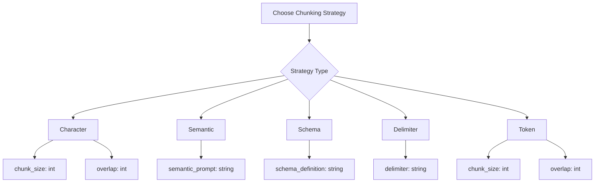

# Chunk Module API Usage Guide

The Compileo Chunk Module provides a flexible API for document chunking with multiple strategies. This guide covers how to use the chunking API endpoints programmatically.

## Chunking Strategy Options



## API Endpoints

### Chunk Retrieval
**GET** `/api/v1/chunks/document/{document_id}`

Retrieve all chunks for a specific document.

**Response:**
```json
{
  "document_id": 1,
  "chunks": [
    {
      "id": 1,
      "chunk_index": 1,
      "token_count": 278,
      "file_path": "storage/chunks/1/1/chunk_1.md",
      "content_preview": "# PROGNOSIS\nMost patients respond well...",
      "chunk_strategy": "schema"
    }
  ],
  "total": 5
}
```

**GET** `/api/v1/chunks/project/{project_id}`

Retrieve chunks for all documents associated with a specific project. Useful for validating project-wide processing status.

**Query Parameters:**
- `limit`: Maximum number of chunks to return (default: 100)

**Response:**
```json
{
  "project_id": "b357e573-89a5-4b40-8e1b-4c075a1835a6",
  "chunks": [
    {
      "id": "uuid-1",
      "document_id": "uuid-doc-1",
      "chunk_index": 1,
      "chunk_strategy": "semantic",
      "file_path": "storage/chunks/..."
    }
  ],
  "total": 1
}
```

### Chunk Deletion
**DELETE** `/api/v1/chunks/{chunk_id}`

Delete a specific chunk.

**Response:**
```json
{
  "message": "Chunk 1 deleted successfully"
}
```

**DELETE** `/api/v1/chunks/batch`

Delete multiple chunks by their IDs. Supports flexible input formats for bulk operations.

**Request Body:**
```json
{
  "chunk_ids": [1, 2, 3, 5, 7, 10]
}
```

**Response:**
```json
{
  "message": "Successfully deleted 6 chunks",
  "deleted_count": 6
}
```

**DELETE** `/api/v1/chunks/document/{document_id}`

Delete all chunks for a document.

**Response:**
```json
{
  "message": "Deleted 5 chunks for document 1",
  "deleted_count": 5
}
```

### Document Processing
**POST** `/api/v1/documents/process`

Process documents with specified chunking strategy and parameters.

### AI-Assisted Analysis
**POST** `/api/v1/documents/analyze-chunking`

Get AI recommendations for optimal chunking strategy based on document analysis.

#### AI Analysis Request Parameters

| Parameter | Type | Required | Description |
|-----------|------|----------|-------------|
| `document_id` | integer | Yes | ID of document to analyze |
| `goal` | string | Yes | Description of chunking objective |
| `examples` | array | No | List of example strings from document |
| `model` | string | No | AI model for analysis (`gemini`, `grok`, `ollama`) |

#### AI Analysis Example Request

```json
{
  "document_id": 101,
  "goal": "Split the document at every chapter, but each chapter has a different name and format",
  "examples": [
    "Page 1: Headers: # Chapter 1: Introduction",
    "Page 3: Section: This chapter provides an overview...",
    "Page 5: Selected: Each new chapter starts with a level 1 header"
  ],
  "model": "gemini"
}
```

#### AI Analysis Response

```json
{
  "recommended_strategy": "schema",
  "parameters": {
    "json_schema": "{\"rules\": [{\"type\": \"pattern\", \"value\": \"^# \"}, {\"type\": \"delimiter\", \"value\": \"\\n\\n\"}], \"combine\": \"any\"}",
    "explanation": "Schema-based chunking recommended for consistent chapter header patterns"
  },
  "confidence": 0.85,
  "alternative_strategies": [
    {
      "strategy": "semantic",
      "parameters": {"custom_prompt": "Split at chapter boundaries..."},
      "confidence": 0.72
    }
  ]
}
```

### Request Parameters

| Parameter | Type | Required | Description |
|-----------|------|----------|-------------|
| `project_id` | integer | Yes | ID of the project containing documents |
| `document_ids` | array | Yes | List of document IDs to process |
| `parser` | string | No | Document parser (`gemini`, `grok`, `ollama`, `pypdf`, `unstructured`, `huggingface`, `novlm`) |
| `chunk_strategy` | string | No | Chunking strategy (`token`, `character`, `semantic`, `delimiter`, `schema`) |
| `chunk_size` | integer | No | Chunk size (tokens for token strategy, characters for character strategy) |
| `overlap` | integer | No | Overlap between chunks |
| `num_ctx` | integer | No | Context window size for Ollama models (overrides default setting) |
| `semantic_prompt` | string | No | Custom prompt for semantic chunking |
| `schema_definition` | string | No | JSON schema for schema-based chunking |
| `character_chunk_size` | integer | No | Character chunk size (overrides chunk_size) |
| `character_overlap` | integer | No | Character overlap (overrides overlap) |
| `sliding_window` | boolean | No | Enable sliding window chunking for multi-file documents (auto-enabled for multi-file docs) |
| `system_instruction` | string | No | System-level instructions to guide the model's behavior, especially for Gemini. |

## Character-Based Chunking

Split documents by character count with configurable overlap. Fast and deterministic.

### Example Request

```json
{
  "project_id": 1,
  "document_ids": [101, 102],
  "parser": "pypdf",
  "chunk_strategy": "character",
  "character_chunk_size": 500,
  "character_overlap": 50
}
```

### Use Cases
- Fixed-size text processing
- Memory-constrained environments
- Deterministic chunking results
- Simple document structures

## Semantic Chunking

Use AI to intelligently split documents based on meaning and context. Supports multi-file documents with **dynamic cross-file chunking** for semantic coherence.

### Simplified Universal Cross-File Document Support

The API automatically handles multi-file documents using **universal forwarding logic** that ensures semantic coherence across file boundaries:

- **Universal Forwarding Rules**: All chunking strategies use the same simple rule - if content remains at the end, forward it to the next file
- **Strategy-Agnostic Detection**: Removed complex per-strategy incomplete chunk detection code
- **Automatic Content Spacing**: Intelligent space insertion between forwarded content and main content prevents word concatenation
- **Memory-Based State Management**: Simplified ChunkState object maintains forwarded content between file processing

**Automatic Processing:** Cross-file chunking is automatically applied to multi-file documents. The system dynamically forwards incomplete chunks as overlap content to subsequent files.

**Benefits:**
- Improved semantic chunking quality at file boundaries
- Better search results with reduced duplication
- More coherent chunks for AI processing
- Simplified architecture with universal forwarding rules
- All 5 chunking strategies (character, token, semantic, schema, delimiter) use identical logic
 
### Example Request
 
```json
{
  "project_id": 1,
  "document_ids": [101],
  "parser": "ollama",
  "chunk_strategy": "semantic",
  "semantic_prompt": "This is a medical textbook that is structured as follows: disease / condition and discussion about it, then another disease / condition and discussion about it. Split should occur at the end of each discussion and before next disease / condition title.",
  "num_ctx": 4096
}```
 
### Prompt Examples
 
**General Purpose (Recommended for all models including Gemini):**
```
You are an expert document analysis tool. Your task is to split a document into logical chunks based on the user's instruction. You will be given an instruction and the document text. You must identify the exact headings or titles that mark the beginning of a new chunk according to the instruction.

**User Instruction:**
{user_instruction}

**Output Requirements:**
- Return ONLY a comma-separated list of the exact heading strings that should start a new chunk.
- Do not include any other text, explanations, or formatting.
- Each heading should be exactly as it appears in the document.

**Example:**
If the instruction is "Split by chapter" and the text contains "# Chapter 1" and "# Chapter 2", your output should be:
# Chapter 1,# Chapter 2

**Document to analyze:**
```
 
**Medical Textbooks (Example of specific user_instruction):**
```
This is a medical textbook that is structured as follows: disease / condition and discussion about it, then another disease / condition and discussion about it. Split should occur at the end of each discussion and before next disease / condition title.
```
 
**General Medical Documents (Example of specific user_instruction):**
```
Split this medical document at natural section boundaries, ensuring each chunk contains complete clinical information about a single condition, symptom, or treatment.
```
 
**Legal Documents (Example of specific user_instruction):**
```
Divide this legal document at section boundaries, keeping each complete legal clause, definition, or contractual obligation in a single chunk.
```
 
**Technical Documentation (Example of specific user_instruction):**
```
Split this technical document at logical boundaries, ensuring each chunk contains complete explanations of single concepts, algorithms, or procedures.
```
 
### Use Cases
- Complex document structures
- Meaning preservation
- Context-aware splitting
- Domain-specific requirements
- Medical textbooks and clinical documents
- Multi-file document processing
 
### Ollama Context Window Configuration
 
When using Ollama models for semantic chunking, you can control the context window size:
 
- **`num_ctx`**: Specifies the maximum context length in tokens for Ollama models
- **Default**: Uses the value configured in GUI settings (typically 60000 tokens)
- **Override**: API parameter takes precedence over settings default
- **Performance**: Smaller values reduce memory usage but may limit complex analysis
- **Compatibility**: Only applies to Ollama models; ignored for Gemini/Grok
 
### Recent Improvements

**Simplified Universal Cross-File Chunking Architecture:**
- **Universal Forwarding Rules**: All chunking strategies use the same simple rule - if content remains at end, forward it to next file
- **Strategy-Agnostic Detection**: Removed 50+ lines of complex per-strategy incomplete chunk detection code
- **Automatic Content Spacing**: Intelligent space insertion between forwarded content and main content prevents word concatenation
- **Memory-Based State Management**: Simplified ChunkState object maintains forwarded content between file processing
- **All Strategies Unified**: Character, token, semantic, schema, and delimiter strategies use identical cross-file logic

**Enhanced Content Processing:**
- **Intelligent Spacing**: Automatic space insertion prevents issues like "glutendamages" → "gluten damages"
- **Simplified Architecture**: Single forwarding mechanism instead of strategy-specific code
- **Memory Efficient**: No duplicate content storage or complex overlap calculations
- **Universal Compatibility**: Works identically across all 5 chunking strategies

**Streamlined Implementation:**
- **Removed Strategy-Specific Code**: Eliminated complex per-strategy incomplete chunk detection logic
- **Dynamic Overlap Generation**: Overlap created naturally during chunking, not pre-computed
- **Simplified Data Structures**: Clean content processing with automatic forwarding
- **Improved Performance**: Reduced complexity and memory usage in cross-file processing

**Enhanced Quality Assurance:**
- **Comprehensive Testing**: Verified all chunking strategies work correctly with cross-file processing
- **Real-World Validation**: Tested on medical documents with proper semantic coherence
- **Spacing Integrity**: Automatic prevention of word concatenation across file boundaries
- **Universal Logic**: Same forwarding rules apply to all strategies regardless of complexity
 
## Dynamic Cross-File Chunking

Advanced chunking method that dynamically generates overlap content during processing, ensuring semantic coherence across file boundaries. Automatically applied to multi-file documents with guaranteed boundary integrity.

### How It Works

1. **Sequential File Processing**: Files are processed one by one in order
2. **Universal Forwarding Logic**: All chunking strategies use the same simple rule - if content remains at the end, forward it to the next file
3. **Automatic Content Spacing**: Intelligent space insertion between forwarded content and main content prevents word concatenation
4. **Memory-Based State Management**: Simplified ChunkState object maintains forwarded content between file processing
5. **Strategy Transparency**: Chunking engines unaware of cross-file logic - they process complete content

### Processing Flow

```
File 1 Processing:
├── Apply chunking strategy to main_content
├── Create complete chunks + leftover content
├── Forward leftover → File 2's overlap_content

File 2 Processing:
├── Combine: overlap_from_file1 + separator + main_content
├── Apply chunking strategy to combined content
├── Create complete chunks + new leftover content
├── Forward new leftover → File 3's overlap_content

File N Processing:
├── Combine: overlap_from_prev + separator + main_content
├── Apply chunking strategy
├── Create final complete chunks
```

### Universal Forwarding Mechanism

The architecture ensures **100% boundary integrity** with simplified logic:

- **Parsing**: Creates clean `main_content` without overlap assumptions
- **First File**: Processes from natural document start
- **Subsequent Files**: Receive overlap as guaranteed start boundary
- **All Strategies**: Use identical forwarding rules regardless of chunking method
- **Automatic Spacing**: Prevents word concatenation (e.g., "glutendamages" → "gluten damages")
 
### Example Request
 
```json
{
  "project_id": 1,
  "document_ids": [101, 102, 103],
  "parser": "gemini",
  "chunk_strategy": "semantic",
  "sliding_window": true
}
```
 
### Window Processing Structure
 
Each window contains structured content for AI processing:
 
```json
{
  "content_type": "sliding_window_chunk",
  "main_content": "# Chapter 3: Advanced Topics\n\nThis chapter covers...",
  "overlap_content": "# Chapter 2 Conclusion\n\nIn summary, the basic concepts...",
  "metadata": {
    "window_size": 2500,
    "overlap_tokens": 400,
    "total_tokens": 2900
  }
}
```
 
### Use Cases
 
- **Large Multi-File Documents**: PDFs split into multiple parts
- **Cross-File Continuity**: Topics spanning artificial file boundaries
- **Semantic Coherence**: Maintaining context across pagination breaks
- **Quality Improvement**: Better search results and AI processing
 
### Configuration Options

- **Automatic Detection**: Applied automatically to documents with multiple parsed files

## Schema-Based Chunking

Apply custom rules combining patterns and delimiters for precise control.

### Schema Format

The API automatically attempts to fix common JSON syntax errors in regex patterns (e.g., unescaped `\s`, `\n`) and literal control characters, but it is best practice to provide a fully escaped JSON string.

**Regex Support:** Schema strategies now support `re.MULTILINE`, allowing the use of `^` anchors to match the start of lines within a document.

```json
{
  "rules": [
    {
      "type": "pattern",
      "value": "# [A-Z\\\\s]+"
    },
    {
      "type": "delimiter",
      "value": "\\\\n\\\\n"
    }
  ],
  "combine": "any"
}
```

### Combine Options
- `"any"`: Split when any rule matches
- `"all"`: Split only when all rules match at the same position

### Example Request

```json
{
  "project_id": 1,
  "document_ids": [101],
  "parser": "unstructured",
  "chunk_strategy": "schema",
  "schema_definition": "{\"rules\": [{\"type\": \"pattern\", \"value\": \"^## \"}, {\"type\": \"delimiter\", \"value\": \"\\n\\n\"}], \"combine\": \"any\"}"
}
```

### Rule Types

**Pattern Rules:**
- Use regex patterns to match specific text structures
- Supports `re.MULTILINE` mode (use `^` to match start of line)
- Examples: `"^# "`, `"^[0-9]+\."`, `"<chapter>"`

**Delimiter Rules:**
- Split on exact string matches
- Examples: `"\n\n"`, `"<hr>"`, `"---"`

### Use Cases
- Structured documents with known patterns
- Custom document formats
- Precise control requirements
- Multi-criteria splitting

## Delimiter-Based Chunking

Simple splitting on specified delimiter strings with enhanced flexibility for multiple delimiters.

### Parameters

| Parameter | Type | Required | Description |
|-----------|------|----------|-------------|
| `delimiters` | array | No | List of delimiter strings to split on (default: `["\n\n", "\n"]`) |
| `chunk_size` | integer | No | Maximum chunk size in characters |
| `overlap` | integer | No | Overlap between chunks in characters |

### Example Request

```json
{
  "project_id": 1,
  "document_ids": [101],
  "parser": "pypdf",
  "chunk_strategy": "delimiter",
  "delimiters": ["#", "\n\n", "---"],
  "chunk_size": 1000,
  "overlap": 100
}
```

### Delimiter Examples

**Markdown Headers:**
```json
{
  "delimiters": ["#", "##", "###"]
}
```

**Mixed Delimiters:**
```json
{
  "delimiters": ["\n\n", "---", "<hr>"]
}
```

**Custom Patterns:**
```json
{
  "delimiters": ["SECTION:", "CHAPTER", "<div class=\"chapter\">"]
}
```

### Use Cases
- Simple document structures
- Known separator patterns
- Quick processing needs
- Markdown document chunking
- Custom delimiter patterns

## Token-Based Chunking

Precise token counting using tiktoken library with overlap. Requires tiktoken package to be installed.

### Example Request

```json
{
  "project_id": 1,
  "document_ids": [101],
  "parser": "grok",
  "chunk_strategy": "token",
  "chunk_size": 512,
  "overlap": 50
}
```

### Error Handling

**Token chunking will fail explicitly** if:
- `tiktoken` library is not installed
- Invalid tokenizer model specified
- Strategy creation fails for any reason

**Error Response:**
```json
{
  "detail": "Failed to create token-based chunking strategy: No module named 'tiktoken'. Token-based chunking requires tiktoken library."
}
```

### Use Cases
- LLM input preparation with exact token limits
- Token-aware processing for API constraints
- Precise semantic chunking based on token boundaries

## Response Format

### Success Response

```json
{
  "job_id": "chunk_job_12345",
  "message": "Successfully processed 1 documents, created 5 chunks",
  "processed_documents": 1,
  "total_chunks": 5,
  "estimated_duration": "Completed",
  "debug_info": {
    "total_requested": 1,
    "project_id": 1,
    "parser": "pypdf",
    "chunk_strategy": "character",
    "character_chunk_size": 500,
    "character_overlap": 50
  }
}
```

### Job Status Checking

**GET** `/api/v1/documents/process/{job_id}/status`

```json
{
  "status": "completed",
  "result": {
    "processed_documents": 1,
    "total_chunks": 5
  }
}
```

## Error Handling

### Common Errors

**400 Bad Request:**
```json
{
  "detail": "Invalid chunk_strategy. Must be one of: token, character, semantic, delimiter, schema"
}
```

**422 Validation Error:**
```json
{
  "detail": [
    {
      "loc": ["body", "character_chunk_size"],
      "msg": "ensure this value is greater than 0",
      "type": "value_error.const"
    }
  ]
}
```

## Best Practices

### Strategy Selection
- **Character**: For simple, fast processing
- **Semantic**: For complex documents requiring AI understanding
- **Schema**: For structured documents with known patterns
- **Delimiter**: For simple separator-based splitting
- **Token**: For LLM-specific token limits

### Performance Optimization
- Use character strategy for large volumes
- Batch multiple documents together
- Choose appropriate parsers for document types
- Monitor job status for long-running processes

### Error Prevention
- Validate schema JSON before submission
- Test prompts with sample documents
- Use appropriate chunk sizes for your use case
- Monitor API rate limits for AI strategies

## Integration Examples

### Python Client

```python
import requests

# Character chunking
response = requests.post("http://localhost:8000/api/v1/documents/process", json={
    "project_id": 1,
    "document_ids": [101],
    "chunk_strategy": "character",
    "character_chunk_size": 500,
    "character_overlap": 50
})

# Semantic chunking
response = requests.post("http://localhost:8000/api/v1/documents/process", json={
    "project_id": 1,
    "document_ids": [101],
    "chunk_strategy": "semantic",
    "semantic_prompt": "Split at natural topic boundaries..."
})
```

### JavaScript Client

```javascript
// Character chunking
const response = await fetch('/api/v1/documents/process', {
  method: 'POST',
  headers: { 'Content-Type': 'application/json' },
  body: JSON.stringify({
    project_id: 1,
    document_ids: [101],
    chunk_strategy: 'character',
    character_chunk_size: 500,
    character_overlap: 50
  })
});
```

This API provides comprehensive document chunking capabilities with multiple strategies to handle diverse document processing needs.