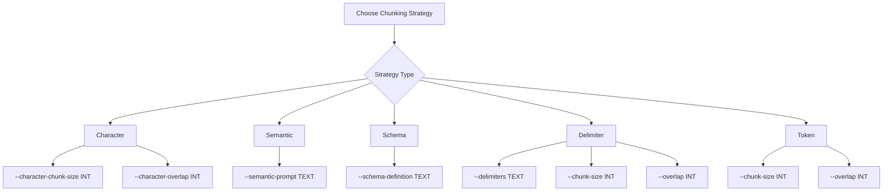

# Chunk Module CLI Usage Guide

The Compileo Chunk Module provides comprehensive command-line tools for document chunking with multiple strategies. This guide covers how to use the chunking CLI commands for batch processing and automation.

**Note:** The CLI has been recently refactored into modular components for better maintainability. The commands remain the same but are now powered by a more robust architecture.

## Chunking Strategy Options



## CLI Commands

### Document Upload

Upload documents to a project before processing:

```bash
compileo documents upload --project-id 1 document1.pdf document2.docx
```

**Parameters:**
- `--project-id`: Project ID to upload documents to (required)
- `file_paths`: One or more document file paths (required)

**Example Output:**
```
📤 Uploading 2 documents to project 1...
✅ Documents uploaded successfully. Job ID: doc_upload_12345
📊 Files uploaded: 2
✅ Upload completed. 2 documents processed.
```

### Document Parsing

Parse documents to markdown format without chunking:

```bash
compileo documents parse --project-id 1 --document-ids 101,102 --parser gemini
```

**Parameters:**
- `--project-id`: Project ID containing documents (required)
- `--document-ids`: Comma-separated list of document IDs (required)
- `--parser`: Document parser (`gemini`, `grok`, `ollama`, `pypdf`, `unstructured`, `huggingface`, `novlm`) (default: `gemini`)

**Example Output:**
```
📄 Parsing 2 documents in project 1 with gemini
✅ Parsing started. Job ID: parse_job_12345
⏳ Waiting for parsing completion...
✅ Parsing completed successfully!
📊 Results: 2 documents parsed to markdown
```

### AI-Assisted Chunking Analysis

Get AI recommendations for optimal chunking strategy:

```bash
compileo documents analyze --document-id 101 --goal "Split the document at every chapter, but each chapter has a different name and format" --examples "Page 1: Headers: # Chapter 1: Introduction" "Page 3: Section: This chapter provides an overview..."
```

**Parameters:**
- `--document-id`: Document ID to analyze (required)
- `--goal`: Description of chunking objective (required)
- `--examples`: Example strings from document (optional, multiple allowed)
- `--model`: AI model for analysis (`gemini`, `grok`, `ollama`) (default: `gemini`)

**Example Output:**
```
🤖 Analyzing document 101 for chunking recommendations...
📊 Document: research_paper.pdf (14,258 chars, 2,350 words)
🎯 Goal: Split the document at every chapter, but each chapter has a different name and format
📝 Examples: 3 provided
✅ Analysis complete!

📋 AI Recommendations:
Strategy: schema
Parameters:
  json_schema: {"rules": [{"type": "pattern", "value": "^# "}, {"type": "delimiter", "value": "\n\n"}], "combine": "any"}
Confidence: 85%
Explanation: Schema-based chunking recommended for consistent chapter header patterns

💡 Alternative: semantic (72% confidence)```

### Document Chunking

Chunk already parsed documents using specified chunking strategy. For multi-file documents, dynamic cross-file chunking is automatically applied with guaranteed boundary integrity.

```bash
compileo documents chunk --project-id 1 --document-ids 101,102 --chunk-strategy character --character-chunk-size 500 --character-overlap 50
```

**Parameters:**
- `--project-id`: Project ID containing documents (required)
- `--document-ids`: Comma-separated list of document IDs (required)
- `--chunk-strategy`: Chunking strategy (`token`, `character`, `semantic`, `delimiter`, `schema`) (default: `token`)
- `--chunk-size`: Chunk size (tokens for token strategy, characters for character strategy) (default: 512)
- `--overlap`: Overlap between chunks (default: 50)
- `--num-ctx`: Context window size for Ollama models (overrides default setting)
- `--chunker`: AI model for intelligent chunking (`gemini`, `grok`, `ollama`) (default: `gemini`)
- `--semantic-prompt`: Custom prompt for semantic chunking
- `--schema-definition`: JSON schema for schema-based chunking
- `--delimiters`: Comma-separated list of delimiter strings for delimiter-based chunking (default: `["\n\n", "\n"]`)
- `--character-chunk-size`: Character chunk size (overrides --chunk-size)
- `--character-overlap`: Character overlap (overrides --overlap)
- `--sliding-window`: Force sliding window chunking (default: auto-detected for multi-file documents)
- `--window-size`: Sliding window size in tokens (default: 3000). **Note: This parameter is currently ignored; system settings are used instead.**
- `--window-overlap`: Sliding window overlap in tokens (default: 500). **Note: This parameter is currently ignored; system settings are used instead.**
- `--system-instruction`: System-level instructions to guide the model's behavior, especially for Gemini.

**Example Output:**
```
✂️ Chunking 2 documents in project 1
Strategy: character, Model: gemini
✅ Chunking started. Job ID: chunk_job_67890
⏳ Waiting for chunking completion...
✅ Chunking completed successfully!
📊 Results: 2 documents processed, 15 chunks created
```

### Document Processing (Combined Parse + Chunk)

Process documents with both parsing and chunking in a single step:

```bash
compileo documents process --project-id 1 --document-ids 101,102 --chunk-strategy character --character-chunk-size 500 --character-overlap 50
```

**Parameters:**
- `--project-id`: Project ID containing documents (required)
- `--document-ids`: Comma-separated list of document IDs (required)
- `--parser`: Document parser (`gemini`, `grok`, `ollama`, `pypdf`, `unstructured`, `huggingface`, `novlm`) (default: `gemini`)
- `--chunk-strategy`: Chunking strategy (`token`, `character`, `semantic`, `delimiter`, `schema`) (default: `token`)
- `--chunk-size`: Chunk size (tokens for token strategy, characters for character strategy) (default: 512)
- `--overlap`: Overlap between chunks (default: 50)
- `--semantic-prompt`: Custom prompt for semantic chunking
- `--schema-definition`: JSON schema for schema-based chunking
- `--character-chunk-size`: Character chunk size (overrides --chunk-size)
- `--character-overlap`: Character overlap (overrides --overlap)
- `--system-instruction`: System-level instructions to guide the model's behavior, especially for Gemini.

### View Document Content

View parsed content of a document with pagination support:

```bash
compileo documents content 101 --page 1 --page-size 3000
```

**Parameters:**
- `document_id`: Document ID to view (required)
- `--page`: Page number to view (default: 1)
- `--page-size`: Characters per page (default: 3000)
- `--output`: Save content to file instead of displaying

**Example Output:**
```
Document 101 - Page 1 of 5
Total: 14,258 characters, 2,350 words, 280 lines
[Content displayed here...]

Page 1 of 5
Next: compileo documents content 101 --page 2
```

## Character-Based Chunking

Split documents by character count with configurable overlap. Fast and deterministic for batch processing.

### Basic Usage

```bash
# Simple character chunking
compileo documents process --project-id 1 --document-ids 101 --chunk-strategy character --character-chunk-size 1000 --character-overlap 100

# With custom parser
compileo documents process --project-id 1 --document-ids 101 --parser pypdf --chunk-strategy character --character-chunk-size 500 --character-overlap 50
```

### Use Cases
- **Batch Processing**: Process large volumes of documents quickly
- **Memory Management**: Predictable memory usage for large document sets
- **Automation**: Integrate into CI/CD pipelines and scripts
- **Testing**: Deterministic results for testing and validation

### Example Output
```
⚙️ Processing 1 documents in project 1
🔍 Parser: pypdf
✂️ Chunk Strategy: character
✅ Processing started. Job ID: chunk_job_67890
⏳ Waiting for processing completion...
✅ Processing completed successfully!
📊 Results: 1 documents processed, 15 chunks created
```

## Semantic Chunking

Use AI to intelligently split documents based on meaning and context with custom prompts. Supports multi-file documents with **dynamic cross-file chunking** for guaranteed boundary integrity.

### Simplified Universal Multi-File Document Support

The CLI automatically handles multi-file documents using **universal forwarding logic** that ensures semantic coherence across file boundaries:

- **Universal Forwarding Rules**: All chunking strategies use the same simple rule - if content remains at the end, forward it to the next file
- **Strategy-Agnostic Detection**: Removed complex per-strategy incomplete chunk detection code
- **Automatic Content Spacing**: Intelligent space insertion between forwarded content and main content prevents word concatenation
- **Memory-Based State Management**: Simplified ChunkState object maintains forwarded content between file processing

**Automatic Processing:** Cross-file chunking is automatically applied to multi-file documents. The system dynamically forwards incomplete chunks as overlap content to subsequent files.

**Benefits:**
- Improved semantic chunking quality at file boundaries
- Better search results with reduced duplication
- More coherent chunks for AI processing
- Simplified architecture with universal forwarding rules
- All 5 chunking strategies (character, token, semantic, schema, delimiter) use identical logic

### Basic Usage

```bash
# Medical textbook chunking with custom context window (recommended)
compileo documents process --project-id 1 --document-ids 101 --chunk-strategy semantic --chunker ollama --num-ctx 4096 --semantic-prompt "This is a medical textbook that is structured as follows: disease / condition and discussion about it, then another disease / condition and discussion about it. Split should occur at the end of each discussion and before next disease / condition title."

# General medical document chunking
compileo documents process --project-id 1 --document-ids 101 --chunk-strategy semantic --semantic-prompt "Split this medical document at natural section boundaries, ensuring each chunk contains complete clinical information about a single condition or procedure."

# Legal document chunking
compileo documents process --project-id 1 --document-ids 102 --chunk-strategy semantic --semantic-prompt "Divide this legal document at section boundaries, keeping each complete legal clause, definition, or contractual obligation in a single chunk."
```

### Advanced Prompt Examples

**General Purpose (Recommended for all models including Gemini):**
```bash
compileo documents process --project-id 1 --document-ids 101 --chunk-strategy semantic --semantic-prompt "You are an expert document analysis tool. Your task is to split a document into logical chunks based on the user's instruction. You will be given an instruction and the document text. You must identify the exact headings or titles that mark the beginning of a new chunk according to the instruction.

**User Instruction:**
{user_instruction}

**Output Requirements:**
- Return ONLY a comma-separated list of the exact heading strings that should start a new chunk.
- Do not include any other text, explanations, or formatting.
- Each heading should be exactly as it appears in the document.

**Example:**
If the instruction is 'Split by chapter' and the text contains '# Chapter 1' and '# Chapter 2', your output should be:
# Chapter 1,# Chapter 2

**Document to analyze:**
" --system-instruction "You are an expert document analysis AI. Your role is to act as a text-splitting engine. You will be given a user instruction and a document. Your sole purpose is to identify the exact split points in the document based on the user's semantic instructions and split the text into chunks.

Here is your chain of thought:
1.  **Analyze the user's instruction**: Understand the semantic meaning of how the user wants to split the document.
2.  **Scan the document**: Read through the document to identify the natural structure and content blocks.
3.  **Identify split points**: Based on the user's instruction, pinpoint the exact locations in the text where a split should occur.
4.  **Create chunks**: Split the document at these points. The chunks should contain the original, unmodified text.
5.  **Format the output**: Return a clean, comma-separated list of the exact headings or titles that mark the beginning of each new chunk. Do not include any other text, explanations, or formatting.
"```
 
**Medical Textbooks (Example of specific user_instruction):**
```bash
compileo documents process --project-id 1 --document-ids 101 --chunk-strategy semantic --semantic-prompt "This is a medical textbook that is structured as follows: disease / condition and discussion about it, then another disease / condition and discussion about it. Split should occur at the end of each discussion and before next disease / condition title."```
 
**General Medical Documents (Example of specific user_instruction):**
```bash
compileo documents process --project-id 1 --document-ids 101 --chunk-strategy semantic --semantic-prompt "Split this medical document at natural section boundaries, ensuring each chunk contains complete clinical information about a single condition, symptom, or treatment. Pay special attention to maintaining the integrity of diagnostic criteria and treatment protocols."
```
 
**Technical Documentation (Example of specific user_instruction):**
```bash
compileo documents process --project-id 1 --document-ids 103 --chunk-strategy semantic --semantic-prompt "Split this technical document at logical boundaries, ensuring each chunk contains complete explanations of single concepts, algorithms, or procedures. Keep code examples with their explanations."
```
 
**Research Papers (Example of specific user_instruction):**
```bash
compileo documents process --project-id 1 --document-ids 104 --chunk-strategy semantic --semantic-prompt "Divide this research paper at meaningful section boundaries, keeping complete methodologies, results, and discussions intact. Ensure each chunk represents a coherent scientific contribution."
```

### Use Cases
- **Complex Documents**: Documents requiring AI understanding of context
- **Domain-Specific**: Specialized content needing expert knowledge
- **Quality Requirements**: When semantic coherence is critical
- **Research Applications**: Academic and technical document processing

## Schema-Based Chunking

Apply custom rules combining patterns and delimiters for precise control over document splitting.

### Schema Definition

Create JSON schemas with multiple rules. **Note:** The CLI automatically attempts to fix common JSON syntax errors in regex patterns (e.g., unescaped `\s`, `\n`) and literal control characters, but it is best practice to provide a fully escaped JSON string.

```json
{
  "rules": [
    {"type": "pattern", "value": "# [A-Z\\\\s]+"},
    {"type": "delimiter", "value": "\\\\n\\\\n"}
  ],
  "combine": "any"
}
```

### Basic Usage

```bash
# Markdown document chunking (Note the double-escaped backslashes for JSON)
compileo documents process --project-id 1 --document-ids 101 --chunk-strategy schema --schema-definition '{"rules": [{"type": "pattern", "value": "^# "}, {"type": "delimiter", "value": "\\n\\n"}], "combine": "any"}'

# Structured document chunking
compileo documents process --project-id 1 --document-ids 102 --chunk-strategy schema --schema-definition '{"rules": [{"type": "pattern", "value": "<chapter>"}, {"type": "delimiter", "value": "</chapter>"}], "combine": "any"}'
```

### Rule Types

**Pattern Rules (Regex):**```bash
# Headers in markdown
--schema-definition '{"rules": [{"type": "pattern", "value": "^## "}], "combine": "any"}'

# Numbered sections
--schema-definition '{"rules": [{"type": "pattern", "value": "^[0-9]+\\."}], "combine": "any"}'

# XML/HTML tags
--schema-definition '{"rules": [{"type": "pattern", "value": "<section>"}, {"type": "pattern", "value": "<div class=\"chapter\">"}], "combine": "any"}'
```

**Delimiter Rules:**
```bash
# Double line breaks
--schema-definition '{"rules": [{"type": "delimiter", "value": "\n\n"}], "combine": "any"}'

# Custom separators
--schema-definition '{"rules": [{"type": "delimiter", "value": "---"}], "combine": "any"}'

# Page breaks
--schema-definition '{"rules": [{"type": "delimiter", "value": "\f"}], "combine": "any"}'
```

### Combine Options

**"any"**: Split when any rule matches
```bash
--schema-definition '{"rules": [{"type": "pattern", "value": "^# "}, {"type": "delimiter", "value": "\n\n"}], "combine": "any"}'
```

**"all"**: Split only when all rules match at the same position
```bash
--schema-definition '{"rules": [{"type": "pattern", "value": "^# "}, {"type": "delimiter", "value": "\n\n"}], "combine": "all"}'
```

### Use Cases
- **Structured Documents**: Documents with known formatting patterns
- **Custom Formats**: Proprietary document structures
- **Precise Control**: When exact splitting behavior is required
- **Multi-Criteria**: Complex splitting rules combining multiple conditions

## Delimiter-Based Chunking

Simple splitting on specified delimiter strings with enhanced support for multiple delimiters.

### Basic Usage

```bash
# Split on double line breaks (default)
compileo documents process --project-id 1 --document-ids 101 --chunk-strategy delimiter --chunk-size 1000 --overlap 100

# Single delimiter
compileo documents process --project-id 1 --document-ids 102 --chunk-strategy delimiter --delimiters "---" --chunk-size 800 --overlap 50

# Multiple delimiters (comma-separated)
compileo documents process --project-id 1 --document-ids 103 --chunk-strategy delimiter --delimiters "#,---,\n\n" --chunk-size 1000 --overlap 100

# Markdown headers
compileo documents process --project-id 1 --document-ids 104 --chunk-strategy delimiter --delimiters "#" --chunk-size 1500 --overlap 150
```

### Delimiter Examples

**Markdown Documents:**
```bash
# Split on headers
--delimiters "#"

# Split on multiple header levels
--delimiters "#,##,###"
```

**Structured Text:**
```bash
# Section breaks
--delimiters "SECTION:,CHAPTER"

# Custom separators
--delimiters "---,***"
```

**Mixed Content:**
```bash
# Multiple patterns
--delimiters "\n\n,---,<hr>"
```

### Use Cases
- **Simple Structures**: Documents with clear separator patterns
- **Quick Processing**: Fast chunking for basic requirements
- **Known Formats**: Documents with consistent delimiters
- **Markdown Documents**: Split on headers and sections
- **Custom Formats**: Any delimiter pattern you specify

## Token-Based Chunking

Precise token counting using tiktoken library with overlap. Requires tiktoken package to be installed.

### Basic Usage

```bash
# Standard token chunking
compileo documents process --project-id 1 --document-ids 101 --chunk-strategy token --chunk-size 512 --overlap 50

# Smaller chunks for specific models
compileo documents process --project-id 1 --document-ids 102 --chunk-strategy token --chunk-size 256 --overlap 25
```

### Error Handling

**Token chunking will fail explicitly** if:
- `tiktoken` library is not installed
- Invalid tokenizer model specified
- Strategy creation fails for any reason

**Error Output:**
```
Error: Failed to create token-based chunking strategy: No module named 'tiktoken'. Token-based chunking requires tiktoken library.
```

### Use Cases
- **LLM Preparation**: Documents for language model input with exact token limits
- **API Limits**: Respecting token limits of AI services
- **Precise Control**: Token-aware processing for API constraints

## Job Management

### Check Job Status

Monitor processing jobs in real-time:

```bash
# Check upload status
compileo documents status --job-id doc_upload_12345 --type upload

# Check parsing status
compileo documents status --job-id parse_job_12345 --type parse

# Check chunking status
compileo documents status --job-id chunk_job_67890 --type process
```

**Parameters:**
- `--job-id`: Job ID to check (required)
- `--type`: Job type (`upload`, `process`, `parse`) (default: `process`)

**Example Output:**
```
Job Status: COMPLETED
Progress: 100%
Current Step: Processing complete
Documents Processed: 2
Total Chunks Created: 15
```

### List Documents

View documents in a project:

```bash
# List all documents
compileo documents list --project-id 1

# Table format (default)
compileo documents list --project-id 1 --format table

# JSON format
compileo documents list --project-id 1 --format json
```

### Delete Documents

Remove documents and associated chunks:

```bash
# Delete with confirmation prompt
compileo documents delete 101

# Delete without confirmation
compileo documents delete 102 --confirm
```

## Batch Processing Examples

### Process Multiple Documents

```bash
# Upload multiple files
compileo documents upload --project-id 1 doc1.pdf doc2.pdf doc3.pdf

# Process all uploaded documents
compileo documents process --project-id 1 --document-ids 101,102,103 --chunk-strategy character --character-chunk-size 500 --character-overlap 50
```

### Automated Workflow

```bash
#!/bin/bash
# Automated document processing workflow

PROJECT_ID=1

# Upload documents
JOB_ID=$(compileo documents upload --project-id $PROJECT_ID *.pdf | grep "Job ID:" | cut -d' ' -f4)

# Wait for upload completion
while true; do
    STATUS=$(compileo documents status --job-id $JOB_ID --type upload | grep "Status:" | cut -d' ' -f3)
    if [ "$STATUS" = "COMPLETED" ]; then
        break
    fi
    sleep 5
done

# Get document IDs (simplified - would need parsing in real script)
DOC_IDS="101,102,103"

# Process documents
compileo documents process --project-id $PROJECT_ID --document-ids $DOC_IDS --chunk-strategy semantic --semantic-prompt "Split at natural topic boundaries..."
```

## Performance Optimization

### Large Document Sets

```bash
# Use character strategy for speed
compileo documents process --project-id 1 --document-ids 101,102,103,104,105 --chunk-strategy character --character-chunk-size 1000 --character-overlap 100

# Process in smaller batches
compileo documents process --project-id 1 --document-ids 101,102 --chunk-strategy semantic --semantic-prompt "..."
compileo documents process --project-id 1 --document-ids 103,104 --chunk-strategy semantic --semantic-prompt "..."
```

### Memory Management

```bash
# Smaller chunks for memory-constrained environments
compileo documents process --project-id 1 --document-ids 101 --chunk-strategy character --character-chunk-size 256 --character-overlap 25

# Use efficient parsers
compileo documents process --project-id 1 --document-ids 101 --parser pypdf --chunk-strategy character --character-chunk-size 500 --character-overlap 50
```

## Error Handling

### Common Issues

**Invalid Schema:**
```bash
# Error: Invalid JSON in schema-definition
compileo documents process --project-id 1 --document-ids 101 --chunk-strategy schema --schema-definition '{"invalid": json}'
# Fix: Validate JSON before using
```

**Missing Documents:**
```bash
# Error: Document IDs not found
compileo documents process --project-id 1 --document-ids 999
# Fix: Check document IDs with list command
```

**API Key Issues:**
```bash
# Error: AI service authentication failed
compileo documents process --project-id 1 --document-ids 101 --chunk-strategy semantic --semantic-prompt "..."
# Fix: Ensure API keys are configured
```

## Integration with Scripts

### Python Automation

```python
import subprocess
import json

def process_documents(project_id, file_paths, chunk_strategy="character", **kwargs):
    # Upload files
    upload_cmd = ["compileo", "documents", "upload", "--project-id", str(project_id)] + file_paths
    result = subprocess.run(upload_cmd, capture_output=True, text=True)

    # Extract job ID and wait for completion
    # (Implementation would parse result and monitor status)

    # Process documents
    process_cmd = [
        "compileo", "documents", "process",
        "--project-id", str(project_id),
        "--document-ids", "101,102",  # Would be extracted from upload result
        "--chunk-strategy", chunk_strategy
    ]

    # Add strategy-specific parameters
    if chunk_strategy == "character":
        process_cmd.extend(["--character-chunk-size", str(kwargs.get("chunk_size", 500))])
        process_cmd.extend(["--character-overlap", str(kwargs.get("overlap", 50))])

    result = subprocess.run(process_cmd, capture_output=True, text=True)
    return result
```

### Shell Scripting

```bash
#!/bin/bash
# Batch processing script

PROJECT_ID=$1
STRATEGY=$2
INPUT_DIR=$3

# Upload all files in directory
compileo documents upload --project-id $PROJECT_ID $INPUT_DIR/*.*

# Get document IDs (would need implementation)
DOC_IDS=$(compileo documents list --project-id $PROJECT_ID --format json | jq -r '.documents[].id' | tr '\n' ',' | sed 's/,$//')

# Process with specified strategy
case $STRATEGY in
    "character")
        compileo documents process --project-id $PROJECT_ID --document-ids $DOC_IDS --chunk-strategy character --character-chunk-size 500 --character-overlap 50
        ;;
    "semantic")
        compileo documents process --project-id $PROJECT_ID --document-ids $DOC_IDS --chunk-strategy semantic --semantic-prompt "Split at natural topic boundaries..."
        ;;
    "schema")
        compileo documents process --project-id $PROJECT_ID --document-ids $DOC_IDS --chunk-strategy schema --schema-definition '{"rules": [{"type": "pattern", "value": "^# "}], "combine": "any"}'
        ;;
esac
```

This CLI provides powerful batch processing capabilities with all chunking strategies available through an intuitive command-line interface suitable for automation and scripting workflows.