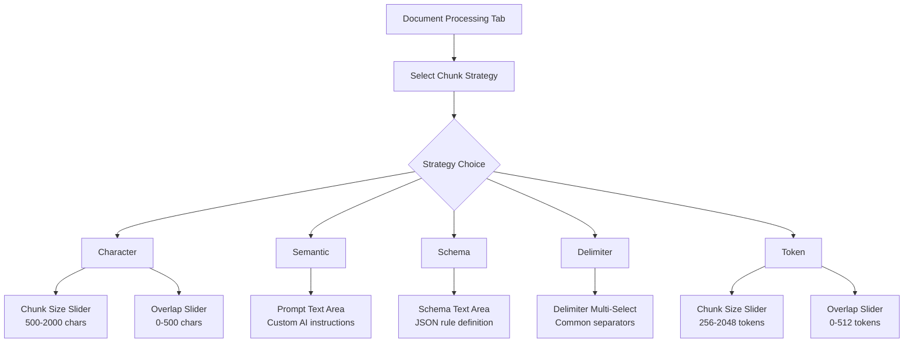

# Chunk Module GUI Usage Guide

The Compileo GUI provides an intuitive web interface for document chunking with multiple strategies. This guide covers how to use the chunking features through the Streamlit-based web application.

## Chunking Strategy Options



## Accessing Document Processing

### Navigation
1. Launch the Compileo GUI: `streamlit run src/compileo/features/gui/main.py`
2. Navigate to the **Document Processing** tab in the sidebar
3. Select your target project from the dropdown

### Chunk Management
The chunk management interface is available in the **Document Processing** tab under the **"📑 View & Manage Chunks"** tab.

**Features:**
- View all chunks for a document with detailed metadata (ID, index, token count)
- Expandable sections with full content preview, displaying chunk indices and token counts (e.g., `Chunk 1 (Tokens: ~150)`) instead of internal IDs
- **Flexible chunk deletion** using simple index numbers (no UUIDs required):
  - Single chunks: `1`
  - Multiple chunks: `1, 3, 5`
  - Ranges: `1-10`
  - Combinations: `1-5, 8, 10-12`
- Bulk document chunk deletion with confirmation
- Refresh button for data reloading

### Interface Overview
The Document Processing tab provides three main sections:
- **Parse Documents Tab**: Upload and parse documents to markdown
- **Configure & Chunk Documents Tab**: Configure chunking strategies and process documents
- **View & Manage Chunks Tab**: View, inspect, and delete chunks

### Configuration Modes
The Configure & Chunk Documents tab offers two configuration approaches:

#### Manual Configuration (Default)
- **Strategy Selection**: Choose from character, semantic, schema, delimiter, or token strategies
- **Parameter Configuration**: Set strategy-specific parameters manually
- **Direct Processing**: Immediate chunking with your chosen settings

#### AI-Assisted Configuration
- **Goal Description**: Describe your chunking objective (required)
- **Document Preview**: Browse document content with pagination
- **Page-Aware Copy**: Extract examples from specific pages
- **AI Recommendations**: Get intelligent strategy suggestions
- **Refined Processing**: Apply AI-recommended parameters

## AI-Assisted Configuration Workflow

The AI-assisted configuration provides intelligent chunking recommendations based on your document structure and goals.

### Streamlined Design Principles
- **No Redundancy**: Single document preview serves both browsing and example extraction
- **Compact Layout**: Example collection shown as editable summary, not verbose expandable sections
- **Progressive Disclosure**: Simple workflow with optional advanced features
- **Contextual Actions**: Copy buttons work on current page without complex page selection
- **Side-by-Side Selection**: Document and parsed file selectors in compact single row for efficient navigation
- **File-Specific Content**: Full parsed file content loading with GUI pagination for large document chunks
- **Seamless Switching**: Instant content updates when changing between parsed files within a document

### Step 1: Describe Your Chunking Goal

**Required Field**: Describe what you want to achieve with chunking.

```text
"I want to split the document at every chapter, but each chapter has a different name and format"
```

**Examples of Good Goals:**
- "Split medical records at patient visit boundaries"
- "Divide legal documents at clause and section breaks"
- "Chunk research papers at methodology, results, and discussion sections"
- "Split technical documentation at feature and API boundaries"

### Step 2: Choose Document and Parsed File for Analysis

1. **Select Document**: Choose a parsed document from the dropdown in the compact selection row
2. **Select Parsed File**: Choose a specific parsed file chunk from the automatically loaded dropdown
3. **Browse Content**: Use pagination controls to navigate through the full parsed file content (10,000 characters per page)
4. **View Metrics**: See total characters, words, and lines for the selected parsed file
5. **Switch Files**: Change between different parsed files within the same document seamlessly
6. **Select Target Documents**: Choose which documents to apply the final chunking configuration to

### Step 3: Extract Examples with Text Selection

Use the **interactive text selection** to extract relevant examples from specific pages:

#### Direct Text Selection
- **Click and drag** to select any portion of text in the content preview area
- **Real-time feedback** shows your current selection in a dedicated field
- **Header highlighting** automatically emphasizes potential headers (markdown # headers, ALL CAPS lines)
- **Flexible selection** allows choosing any text portion (headers, sections, samples, or custom selections)

#### Adding Selected Text to Examples
- **"Copy Selected Text to Examples"** button adds your current selection to the example collection
- **Character count** shows the size of your selection
- **Multiple selections** can be added from different pages
- **Clear selection** button removes current selection without adding to examples

#### Selection Tips
- **Headers first**: Start by selecting document headers as they provide the best guidance for AI chunking
- **Multiple examples**: Collect examples from different parts of the document for better AI understanding
- **Precise selection**: Select exactly the text you want the AI to learn from
- **Context matters**: Include surrounding context when selecting examples to show boundary patterns

### Step 4: Build Example Collection

1. **Navigate Pages**: Use pagination to browse different sections of the document
2. **Select Text**: Click and drag to select meaningful text portions (focus on headers and boundary patterns)
3. **Add to Examples**: Click "Copy Selected Text to Examples" to add your selection
4. **Review Collection**: See all collected examples in an expandable list
5. **Remove if Needed**: Use individual remove buttons to refine your example collection

**Example Collection Summary:**
```
📚 Collected Examples (3 items)
• Example 1 (47 chars): # Introduction
This chapter covers the basic concepts
• Example 2 (38 chars): ## Methods
The methodology section explains our approach
• Example 3 (52 chars): Each chapter begins with a level 1 header followed by content
```

### Step 5: Get AI Recommendations

1. **Click "Analyze & Recommend"**: AI analyzes your goal, document content, and collected examples
2. **Review Recommendations**: AI suggests optimal chunking strategy and parameters
3. **Accept or Modify**: Use AI-recommended settings or make adjustments
4. **Process Documents**: Apply the configuration to your selected target documents

### AI Recommendation Examples

**For Chapter-Based Splitting:**
- **Strategy**: Schema-based
- **Rules**: `[{"type": "pattern", "value": "^# "}, {"type": "delimiter", "value": "\n\n"}]`
- **Combine**: `"any"`

**For Semantic Document Splitting:**
- **Strategy**: Semantic
- **Prompt**: Custom prompt based on your goal and examples
- **Model**: Recommended AI model for your content type

### Tips for Better AI Recommendations

#### Goal Description Tips
- **Be Specific**: "Split at chapter boundaries" vs "Split at every chapter, where chapters start with '# Chapter X:'"
- **Include Context**: Mention document type (medical, legal, technical)
- **Specify Patterns**: Reference actual formatting patterns you observe

#### Example Quality Tips
- **Focus on Headers**: Select document headers first as they provide the clearest chunking guidance
- **Include Context**: When selecting text, include surrounding context to show boundary patterns
- **Multiple Examples**: Collect examples from different parts of the document for comprehensive AI understanding
- **Precise Selection**: Select exactly the text that demonstrates your desired chunking behavior
- **Variety**: Show different types of content boundaries and structural elements

#### Document Selection Tips
- **Representative Sample**: Choose a document that represents your typical content
- **Complete Parsing**: Ensure documents are fully parsed before AI analysis
- **Content Quality**: Use well-structured source documents for better analysis

## Character-Based Chunking

Split documents by character count with configurable overlap. Perfect for simple, fast processing.

### How to Use

1. **Select Strategy**: Choose "Character" from the chunk strategy dropdown
2. **Configure Parameters**:
   - **Chunk Size**: Use the slider to set characters per chunk (500-2000 recommended)
   - **Overlap**: Set character overlap between chunks (10-20% of chunk size)
3. **Upload Documents**: Drag and drop PDF, DOCX, TXT, MD, CSV, JSON, or XML files
4. **Choose Parser**: Select appropriate document parser (pypdf for PDFs, unstructured for Office docs)
5. **Process**: Click the "Process Documents" button

### Example Configuration

```
Chunk Strategy: Character
Chunk Size: 1000 characters
Overlap: 100 characters
Parser: pypdf
Files: medical_report.pdf
```

### When to Use
- **Large Document Sets**: Process many documents quickly
- **Memory Constraints**: Predictable memory usage
- **Simple Requirements**: When semantic understanding isn't needed
- **Testing**: Deterministic results for validation

### Visual Feedback
- Progress bar shows upload and processing status
- Real-time chunk count updates
- Success confirmation with processing statistics

## Semantic Chunking

Use AI to intelligently split documents based on meaning and context with custom prompts. Supports multi-file documents with **dynamic cross-file chunking** for guaranteed boundary integrity.

### ✅ Advanced Universal Cross-File Support

The GUI automatically handles multi-file documents using **universal forwarding logic** that ensures semantic coherence across file boundaries:

- **Universal Forwarding Rules**: All chunking strategies use the same simple rule - if content remains at the end, forward it to the next file
- **Strategy-Agnostic Detection**: Removed complex per-strategy incomplete chunk detection code
- **Automatic Content Spacing**: Intelligent space insertion between forwarded content and main content prevents word concatenation
- **Memory-Based State Management**: Simplified ChunkState object maintains forwarded content between file processing

**Automatic Processing:** Cross-file chunking is automatically applied to multi-file documents. The system dynamically forwards incomplete chunks as overlap content to subsequent files.

**Benefits:**
- Improved semantic chunking quality at file boundaries
- Better search results with reduced duplication
- More coherent chunks for AI processing
- Simplified architecture with universal forwarding rules
- All 5 chunking strategies (character, token, semantic, schema, delimiter) use identical logic

### How to Use

1. **Select Strategy**: Choose "Semantic" from the chunk strategy dropdown
2. **Craft Your Prompt**: Use the text area to provide custom instructions for the AI
3. **Upload Documents**: Select documents requiring semantic understanding
4. **Choose AI Model**: Select from available models (Gemini, Grok, Ollama)
5. **Process**: Click "Process Documents"

### Prompt Examples
 
**Medical Textbooks (Recommended):**
```
This is a medical textbook that is structured as follows: disease / condition and discussion about it, then another disease / condition and discussion about it. Split should occur at the end of each discussion and before next disease / condition title.
```
 
**Medical Documents:**
```
Split this medical document at natural section boundaries, ensuring each chunk contains complete clinical information about a single condition, symptom, or treatment. Pay special attention to maintaining the integrity of diagnostic criteria and treatment protocols.
```
 
**Legal Documents:**
```
Divide this legal document at section boundaries, keeping each complete legal clause, definition, or contractual obligation in a single chunk. Preserve the logical flow of legal arguments and obligations.
```
 
**Technical Documentation:**
```
Split this technical document at logical boundaries, ensuring each chunk contains complete explanations of single concepts, algorithms, or procedures. Keep code examples with their explanations.
```
 
**Research Papers:**
```
Divide this research paper at meaningful section boundaries, keeping complete methodologies, results, and discussions intact. Ensure each chunk represents a coherent scientific contribution.
```
 
### Advanced Prompt Techniques
 
**Role-Playing:**
```
You are a medical editor. Split this clinical document at natural breaks where one medical topic ends and another begins. Ensure each chunk tells a complete clinical story.
```
 
**Chain-of-Thought:**
```
Think step-by-step: 1) Identify topic changes, 2) Find natural break points, 3) Ensure content completeness, 4) Split at optimal boundaries. Split this document accordingly.
```
 
**Specific Instructions:**
```
Split at section headers, but also consider content flow. If a section header appears mid-explanation, keep the explanation with its header. Prioritize content coherence over strict header boundaries.
```

### When to Use
- **Complex Documents**: Content requiring AI understanding
- **Domain Expertise**: Specialized knowledge needed for splitting
- **Quality Requirements**: When semantic coherence is critical
- **Custom Logic**: Unique splitting requirements

### Tips for Better Results
- **Be Specific**: Include domain context and desired behavior
- **Provide Examples**: Reference specific patterns in your documents
- **Test Iteratively**: Try different prompts and refine based on results
- **Balance Detail**: Too vague = poor splits, too specific = inflexible

## Schema-Based Chunking

Apply custom rules combining patterns and delimiters for precise document splitting control.

### How to Use

1. **Select Strategy**: Choose "Schema" from the chunk strategy dropdown
2. **Define Schema**: Use the text area to create JSON rules for splitting
3. **Upload Documents**: Select documents matching your schema patterns
4. **Choose Parser**: Select parser that preserves your target patterns
5. **Process**: Click "Process Documents"

### Schema Structure

```json
{
  "rules": [
    {
      "type": "pattern",
      "value": "# [A-Z]+"
    },
    {
      "type": "delimiter",
      "value": "\\n\\n"
    }
  ],
  "combine": "any"
}
```

### Rule Types

#### Pattern Rules (Regex)
Match specific text patterns using regular expressions. **Note: Regex now supports multiline mode! Use `^` to match the start of any line, not just the start of the document.**

```json
{"type": "pattern", "value": "^# "}
```
- `^# `: Markdown headers at the start of a line
- `^[0-9]+\.`: Numbered sections at the start of a line
- `<chapter>`: XML/HTML tags
- `^[A-Z][A-Z\s]+$`: ALL CAPS section headers

#### Delimiter Rules
Split on exact string matches:

```json
{"type": "delimiter", "value": "\n\n"}
```
- `\n\n`: Double line breaks
- `---`: Horizontal rules
- `<hr>`: HTML horizontal rules
- `\f`: Page breaks

### Combine Options

**"any"**: Split when any rule matches
```json
{
  "rules": [
    {"type": "pattern", "value": "^# "},
    {"type": "delimiter", "value": "\n\n"}
  ],
  "combine": "any"
}
```

**"all"**: Split only when all rules match at the same position
```json
{
  "rules": [
    {"type": "pattern", "value": "^# "},
    {"type": "delimiter", "value": "\n\n"}
  ],
  "combine": "all"
}
```

### Schema Examples

**Markdown Documents:**
```json
{
  "rules": [
    {"type": "pattern", "value": "^## "},
    {"type": "delimiter", "value": "\n\n"}
  ],
  "combine": "any"
}
```

**Structured Text:**
```json
{
  "rules": [
    {"type": "pattern", "value": "^SECTION [0-9]+"},
    {"type": "delimiter", "value": "---"}
  ],
  "combine": "any"
}```

**XML/HTML:**
```json
{
  "rules": [
    {"type": "pattern", "value": "<div class=\"chapter\">"},
    {"type": "pattern", "value": "<section>"}
  ],
  "combine": "any"
}
```

### When to Use
- **Structured Documents**: Known formatting patterns
- **Custom Formats**: Proprietary document structures
- **Precise Control**: Exact splitting behavior required
- **Multi-Criteria**: Complex rules combining patterns and delimiters

### Schema Validation and Auto-Correction
The GUI provides robust validation and automatic correction for schema definitions:
- **JSON Syntax**: Checks for valid JSON structure.
- **Auto-Correction**: Automatically fixes common JSON syntax errors in regex patterns (e.g., unescaped `\s`, `\n`) and literal control characters, ensuring the schema is always parseable.
- **Required Fields**: Ensures `rules` and `combine` are present.
- **Rule Validation**: Verifies rule types and values.
- **Error Messages**: Clear feedback for fixing truly invalid schema issues.

## Delimiter-Based Chunking

Simple splitting on specified delimiter strings with size controls. Enhanced with dual-input interface for maximum flexibility.

### How to Use

1. **Select Strategy**: Choose "Delimiter" from the chunk strategy dropdown
2. **Choose Delimiters**: Use the dual-input interface:
   - **Quick Select**: Choose from common delimiters with descriptive labels
   - **Custom Delimiter**: Enter any custom delimiter pattern
3. **Configure Size**: Set chunk size and overlap parameters
4. **Upload Documents**: Select documents with clear delimiter patterns
5. **Process**: Click "Process Documents"

### Enhanced Delimiter Interface

The delimiter strategy now provides two input methods for maximum flexibility:

#### Quick Select (Common Delimiters)
Choose from pre-configured delimiters with clear descriptions:
- **# (Markdown headers)**: Split at markdown headers (default)
- **--- (Horizontal rule)**: Split at horizontal rules
- **### (H3 headers)**: Split at level 3 markdown headers
- **## (H2 headers)**: Split at level 2 markdown headers
- **\n\n (Double newline)**: Split at paragraph breaks
- **\n (Single newline)**: Split at line breaks
- **. **: Split at sentence endings
- **! **: Split at exclamation marks
- **? **: Split at question marks

#### Custom Delimiter Field
Enter any delimiter pattern you need:
- **Markdown headers**: `#`, `##`, `###`
- **HTML/XML tags**: `<div>`, `</section>`, `<chapter>`
- **Custom patterns**: `SECTION:`, `CHAPTER`, `---`
- **Regex patterns**: Any string pattern

#### Smart Combination
- **Automatic merging**: Combines quick-select and custom delimiters
- **Duplicate removal**: Eliminates duplicate delimiters while preserving order
- **User feedback**: Shows selected delimiter count and validation messages

### Configuration Options

```
Chunk Strategy: Delimiter
Quick Select: # (Markdown headers), --- (Horizontal rule)
Custom Delimiter: <section>
Combined Delimiters: ['#', '---', '<section>']
Chunk Size: 1000 characters
Overlap: 100 characters
```

### When to Use
- **Simple Structures**: Documents with clear separator patterns
- **Known Formats**: Consistent delimiter usage
- **Quick Processing**: Fast chunking for basic requirements
- **Text Files**: Plain text with obvious breaks

## Token-Based Chunking

Traditional token counting with overlap for LLM compatibility.

### How to Use

1. **Select Strategy**: Choose "Token" from the chunk strategy dropdown
2. **Configure Parameters**:
   - **Chunk Size**: Set token count per chunk (256-2048 recommended)
   - **Overlap**: Set token overlap between chunks (10-25% of chunk size)
3. **Upload Documents**: Select documents for LLM processing
4. **Choose Parser**: Select appropriate document parser
5. **Process**: Click "Process Documents"

### Token Estimation
- **English Text**: ~4 characters per token
- **Code**: ~2-3 characters per token
- **Mathematical**: ~1-2 characters per token

### Example Configuration

```
Chunk Strategy: Token
Chunk Size: 512 tokens
Overlap: 50 tokens
Parser: gemini
Files: research_paper.pdf
```

### When to Use
- **LLM Input**: Prepare documents for language model processing
- **API Limits**: Respect token limits of AI services
- **Embeddings**: Create chunks for vector embeddings
- **Legacy Compatibility**: Existing token-based workflows

## Processing Workflow

### Step-by-Step Process

1. **Project Selection**
   - Choose existing project or create new one
   - Verify project permissions and space

2. **Document Upload**
   - Drag and drop multiple files
   - Automatic file type detection
   - Progress indicators for large uploads
   - Support for batch processing

3. **Strategy Configuration**
   - Select chunking strategy from dropdown
   - Dynamic form fields appear based on selection
   - Real-time validation and helpful hints
   - Preview of expected behavior

4. **Parser Selection**
   - Choose appropriate document parser
   - Consider document type and complexity
   - Balance speed vs. accuracy

5. **Processing Execution**
   - Click "Process Documents" to start
   - Real-time progress monitoring
   - Job status updates and estimated completion
   - Error handling and retry options

6. **Results Review**
   - View processing statistics
   - Check chunk quality and count
   - Download results or proceed to next steps
   - Error logs and troubleshooting information

### Progress Monitoring

The GUI provides comprehensive progress tracking:

- **Upload Progress**: File-by-file upload status
- **Processing Status**: Current operation and completion percentage
- **Job Management**: Background job tracking with unique IDs
- **Error Reporting**: Clear error messages with suggested fixes
- **Results Summary**: Chunk counts, processing time, and quality metrics

### Error Handling

**Common Issues and Solutions:**

- **Invalid Schema**: Check JSON syntax and required fields
- **Unsupported File Type**: Verify file format compatibility
- **API Key Missing**: Configure AI service credentials in Settings
- **Large File Timeout**: Use character strategy or increase timeout
- **Memory Issues**: Reduce chunk size or process in batches

## Advanced Features

### Batch Processing

Process multiple documents simultaneously:

1. Upload several files at once
2. Configure chunking strategy once
3. Process all documents with same settings
4. Monitor collective progress
5. Review batch results

### Strategy Comparison

Test different strategies on the same document:

1. Process same document with different strategies
2. Compare chunk counts and quality
3. Analyze processing time differences
4. Choose optimal strategy for your use case

### Custom Workflows

Combine chunking with other Compileo features:

1. **Chunk → Extract**: Use chunks for selective taxonomy extraction
2. **Chunk → Generate**: Feed chunks to dataset generation
3. **Chunk → Quality**: Analyze chunk quality metrics
4. **Chunk → Benchmark**: Test chunking impact on model performance

## Best Practices

### Strategy Selection Guide

| Document Type | Recommended Strategy | Reasoning |
|---------------|---------------------|-----------|
| Simple text files | Character | Fast, predictable, no AI required |
| Markdown docs | Schema | Precise control with header patterns |
| Legal documents | Semantic | Complex clause and obligation boundaries |
| Medical records | Semantic | Clinical context and diagnosis integrity |
| Research papers | Semantic | Methodological and discussion coherence |
| Structured data | Delimiter | Known separators and formatting |
| Code repositories | Token | LLM processing compatibility |
| Mixed content | Schema | Flexible rule combinations |

### Performance Optimization

- **Large Documents**: Use character strategy for speed
- **Many Documents**: Process in batches to manage memory
- **AI Strategies**: Choose appropriate models for your needs
- **Quality vs Speed**: Balance requirements with processing time

### Quality Assurance

- **Test Small First**: Try strategies on sample documents
- **Validate Results**: Check chunk boundaries and content integrity
- **Iterate Prompts**: Refine semantic prompts based on results
- **Monitor Metrics**: Track processing time and chunk quality

## Integration with Other Features

### Dataset Generation Workflow

1. **Chunk Documents** → Select appropriate chunking strategy
2. **Review Chunks** → Verify quality and boundaries
3. **Generate Dataset** → Use chunks as input for dataset creation
4. **Quality Check** → Analyze dataset quality metrics
5. **Iterate** → Refine chunking strategy if needed

### Taxonomy Integration

1. **Process Documents** → Create high-quality chunks
2. **Generate Taxonomy** → Use chunks for AI taxonomy creation
3. **Selective Extraction** → Apply taxonomy to chunks
4. **Refine Taxonomy** → Improve based on extraction results

### Benchmarking Connection

1. **Chunk Documents** → Prepare data for model evaluation
2. **Generate Datasets** → Create evaluation datasets
3. **Run Benchmarks** → Test model performance on chunked data
4. **Analyze Results** → Compare chunking strategy impact

This GUI provides comprehensive document chunking capabilities with an intuitive interface, making advanced chunking strategies accessible to users of all technical levels while maintaining the power and flexibility needed for complex document processing workflows.