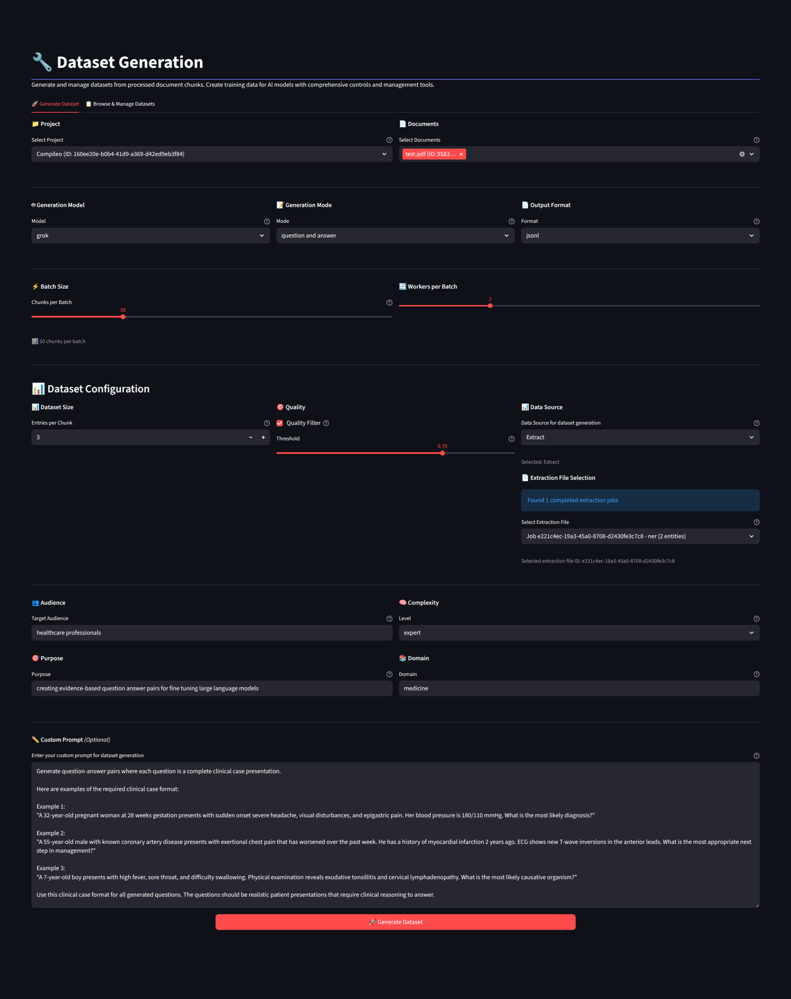

# Dataset Generation Wizard in Compileo GUI

## Overview

The Compileo Dataset Creation Wizard provides a comprehensive, step-by-step interface for generating high-quality datasets from documents. The wizard features flexible navigation, automatic file upload, complete AI model selection, and intelligent data source handling for optimal dataset creation.

<div align="center">
  <a href="../img/datasetgen.png"></a>
  <p><i>Dataset Generation Pipeline</i></p>
</div>

## Key Features

- **5-Step Guided Wizard**: Intuitive workflow with database-mediated state recovery
- **Automatic File Upload**: Drag-and-drop with immediate processing
- **Complete AI Model Selection**: 4-model configuration (parsing, chunking, classification, generation)
- **Full Chunking Strategy Parity**: All Document Processing tab strategies available
- **Database-Mediated Resilience**: Progress is synchronized with the database, allowing workflows to survive session loss or browser refreshes.
- **Smart Data Source Selection**: Automatic taxonomy/chunks fallback
- **Document Management**: Upload and delete capabilities with error correction
- **Real-time Progress Monitoring**: Live job tracking with detailed status updates
- **Interactive Refinement**: Post-generation editing and quality improvement
- **Multi-format Support**: JSONL, Parquet, and extensible plugin formats

## GUI Workflow

### Step 1: Project Selection

**Location:** Dataset Creation Wizard → Step 1
**Purpose:** Choose or create a project for dataset generation

**Features:**
- **Existing Project Selection**: Browse and select from available projects
- **New Project Creation**: Create project with name and description
- **Project Statistics**: View document count, chunk count, and processing status
- **Flexible Navigation**: Click any step tab to navigate non-linearly

**Navigation:**
- Use dropdown to select existing project
- Click "Create New Project" for new projects
- Click "Next" or use step tabs to navigate

### Step 2: Parse & Chunk & Taxonomy

**Location:** Dataset Creation Wizard → Step 2
**Purpose:** Automated end-to-end processing of project documents.

**Features:**
- **Unified Pipeline**: Combined Upload → Parse → Chunk → Auto Taxonomy generation.
- **AI Model Selection**: Configure models for parsing, chunking, classification, and generation in one place.
- **Smart Chunking**: Full parity with standalone Document Processing strategies.
- **Existing Chunk Detection**: Proactively checks the database to see if documents already have processed chunks.
- **Automatic Taxonomy Generation**: Automatically triggers AI taxonomy creation after chunking completes.

### Step 3: Edit Taxonomy

**Location:** Dataset Creation Wizard → Step 3
**Purpose:** Pick and refine the hierarchical structure for your dataset.

**Features:**
- **Taxonomy Selection**: Choose from existing taxonomies or the one just auto-generated.
- **Reactive Editor**: A simplified version of the Hybrid Taxonomy Editor.
- **Real-time Sync**: Changes (adding/removing categories, renaming) are instantly persisted to the project database.
- **Management Tools**: Regenerate or delete taxonomies directly from the wizard.

### Step 4: Generation Parameters

**Location:** Dataset Creation Wizard → Step 4
**Purpose:** Configure dataset generation mode, format, and high-level prompt parameters.

**Features:**
- **High-Level Prompts**: Tailor content by specifying **Target Audience**, **Purpose**, and **Domain**.
- **Complexity Control**: Select difficulty levels (beginner to expert) or let AI decide.
- **Auto-Persistence**: Parameters are automatically saved to the database when clicking "Next", allowing you to resume later.
- **Dataset Generation Modes**: Instruction Following, Q&A, Questions Only, Answers Only, and Summarization.
- **Plugin Support**: Support for specialized formats like Anki via the plugin system.

### Step 5: Review & Generate

**Location:** Dataset Creation Wizard → Step 5
**Purpose:** Final review, execution, and download.

**Features:**
- **Comprehensive Summary**: Review all settings, including AI models and high-level prompts.
- **Database Fallbacks**: Automatically retrieves missing configuration (like chunking strategy) from the database if session state is lost.
- **Real-time Monitoring**: Follow the generation progress in detail, from category aggregation to final formatting.
- **Instant Download**: Upon successful completion, a "Download Generated Dataset" link appears. This system is database-mediated, ensuring the correct version and file format are provided.
**Purpose:** Review and improve generated datasets

<div align="center">
  <a href="../img/dataset_example.png"></a>
  <p><i>Generated Dataset Preview</i></p>
</div>

**Features:**
- **Dataset Review**: Paginated view of generated entries
- **Inline Editing**: Modify questions, answers, and metadata
- **Quality Filtering**: Filter by quality scores and categories
- **Bulk Operations**: Apply changes to multiple entries
- **Feedback System**: Provide feedback for AI improvement
- **Regeneration**: Regenerate specific entries with modifications

**Refinement Capabilities:**
- **Entry Modification**: Edit content and metadata
- **Category Updates**: Reassign categorization
- **Quality Assessment**: Rate and filter entries
- **Batch Processing**: Apply changes across multiple entries
- **Export Options**: Download refined datasets

## Interactive Dataset Refinement

### Post-Generation Editing

**Location:** Dataset Management → Refinement Interface
**Purpose:** Manually improve generated datasets through interactive editing

**Features:**
- **Entry Browser**: Paginated view of all dataset entries
- **Inline Editing**: Direct editing of questions, answers, and metadata
- **Bulk Operations**: Apply changes to multiple entries simultaneously
- **Quality Filtering**: Filter entries by quality score or category
- **Feedback Submission**: Provide feedback for AI learning

**Editing Capabilities:**
- **Question Refinement**: Improve clarity and specificity
- **Answer Enhancement**: Correct or expand answer content
- **Category Assignment**: Update or correct categorization
- **Metadata Updates**: Modify difficulty levels and tags

### Quality Dashboard

**Location:** Quality Dashboard
**Purpose:** Visualize and analyze dataset quality metrics

**Dashboard Components:**
- **Overall Quality Score**: Aggregate quality metric with trend
- **Quality Distribution**: Charts showing high/medium/low quality entries
- **Diversity Metrics**: Lexical and semantic diversity visualizations
- **Bias Detection**: Demographic and content bias indicators
- **Difficulty Analysis**: Readability and complexity distributions

**Interactive Features:**
- **Drill-down**: Click charts to see specific entries
- **Filtering**: Filter dashboard by category, quality score, etc.
- **Export**: Download quality reports in various formats
- **Alerts**: Notifications for quality threshold violations

## Benchmarking Visualization

### Performance Analytics

**Location:** Benchmarking Dashboard
**Purpose:** Analyze AI model performance on generated datasets

**Visualization Types:**
- **Performance Charts**: Accuracy, F1, BLEU scores by model
- **Comparison Tables**: Side-by-side model performance
- **Trend Analysis**: Performance changes over time
- **Benchmark Suite Results**: GLUE, SuperGLUE, MMLU, Medical results

**Interactive Features:**
- **Model Filtering**: Compare specific model combinations
- **Metric Selection**: Choose which metrics to display
- **Historical Tracking**: View performance trends over dataset versions
- **Export Capabilities**: Download performance reports

## Settings and Configuration

### API Key Management

**Location:** Settings → API Keys
**Purpose:** Configure AI model API keys for dataset generation

**Key Management:**
- **Gemini API Key**: Google AI Studio key configuration
- **Grok API Key**: xAI API key setup
- **HuggingFace Token**: For HuggingFace model access
- **Status Indicators**: Real-time validation of key functionality

**Security Features:**
- **Encrypted Storage**: Secure key storage and transmission
- **Validation Testing**: Automatic key validation on save
- **Access Logging**: Audit trail for key usage

### Generation Preferences

**Location:** Settings → Dataset Generation
**Purpose:** Set default preferences for dataset generation

**Default Settings:**
- **Preferred Models**: Set default AI models for each task
- **Quality Thresholds**: Default quality requirements
- **Output Preferences**: Default formats and directories
- **Concurrency Limits**: Default parallel processing limits

## Job Monitoring and Management

### Real-time Job Tracking

**Location:** Sidebar → Job Queue
**Purpose:** Monitor active and completed dataset generation jobs

**Job Queue Features:**
- **Unified Visibility**: Dataset generation jobs now use the same enhanced job queue as extraction and processing jobs, ensuring full visibility in the Job Management dashboard.
- **Active Jobs**: Monitor currently running generation jobs with stage-based status messages.
- **Synchronous Monitoring**: The GUI remains in the current view during generation, providing in-place updates without disruptive page refreshes.
- **Queue Statistics**: Pending, running, and completed job counts are accurately reflected in system metrics.
- **Job Controls**: Cancel or restart generation jobs directly from the dashboard or sidebar.

### Job History and Details

**Location:** Job Management Page
**Purpose:** Comprehensive job history and detailed status information

**Job Management:**
- **Job History**: Complete list of past generation jobs (persisted across sessions)
- **Detailed Status**: Step-by-step job execution details
- **Performance Metrics**: CPU, memory, and timing statistics
- **Error Logs**: Detailed error information for failed jobs
- **Retry Options**: Restart failed jobs with modified parameters
- **Database Reliability**: Job status and progress are maintained even if the server restarts during processing

## Best Practices for GUI Usage

### Project Preparation

1. **Document Upload**: Ensure all documents are uploaded and processed
2. **Chunking Completion**: Verify chunking has completed successfully
3. **Taxonomy Setup**: Create or select appropriate taxonomy
4. **API Key Configuration**: Verify all required API keys are configured

### Model Selection Strategy

1. **Content Analysis**: Choose models based on document complexity
2. **Cost Consideration**: Balance quality needs with API costs
3. **Local vs Cloud**: Use Ollama for development, cloud models for production
4. **Testing**: Start with small datasets to validate model performance

### Plugin Format Usage

1. **Format Discovery**: Plugin-provided formats appear automatically in the format dropdown after plugin installation
2. **Dual Output**: Plugin formats generate both standard JSON and custom format files for reliability
3. **Format Compatibility**: Verify plugin formats meet your target system's requirements (e.g., Anki import specifications)
4. **Plugin Management**: Uninstall unused plugins to clean up format options in the GUI

### Quality Assurance Workflow

1. **Enable Quality Analysis**: Always enable for production datasets
2. **Set Appropriate Thresholds**: Balance quality with generation volume
3. **Review Quality Reports**: Use dashboards to identify improvement areas
4. **Iterative Refinement**: Use refinement interface for continuous improvement

### Performance Optimization

1. **Concurrency Tuning**: Adjust based on available resources and API limits
2. **Chunk Size Optimization**: Balance chunk size with generation quality
3. **Monitoring**: Use job monitoring to identify bottlenecks
4. **Resource Planning**: Monitor API usage and costs

## Troubleshooting

### Common Issues

**"No chunks found for project"**
- Solution: Ensure documents have been uploaded and processed through the document pipeline
- Check: Document status in project view should show "processed"

**"API key not configured"**
- Solution: Configure required API keys in Settings → API Keys
- Check: Status indicators should show green for configured keys

**"Quality threshold not met"**
- Solution: Lower quality threshold or improve source document quality
- Alternative: Disable quality analysis for initial dataset generation

**"Job stuck in pending"**
- Solution: Dataset generation jobs are now managed by the enhanced job queue and persist in Redis. If a job appears stuck, check the "System Status" in the Job Management dashboard for worker health and resource usage.
- Check: Ensure an RQ worker process is running and that global/per-user job limits haven't been exceeded.

### Performance Issues

**Slow Generation**
- Increase concurrency setting (if API limits allow)
- Use more efficient models (Ollama for local processing)
- Reduce datasets per chunk

**Memory Issues**
- Reduce concurrency setting
- Process smaller batches
- Monitor system resources in Job Management

**API Rate Limits**
- Reduce concurrency to stay within API limits
- Implement delays between requests
- Monitor API usage in settings

## Integration with CLI

The GUI provides seamless integration with CLI tools for advanced workflows:

```bash
# Generate dataset via GUI, then analyze quality via CLI
compileo analyze-quality dataset_from_gui.jsonl --format markdown --output quality_report.md

# Use CLI for bulk operations after GUI refinement
compileo dataset-version increment-version --project-id 1 --dataset-name refined_dataset --version-type minor
```

The GUI offers an intuitive, visual approach to dataset generation while maintaining full compatibility with CLI tools for advanced users and automation scenarios.
