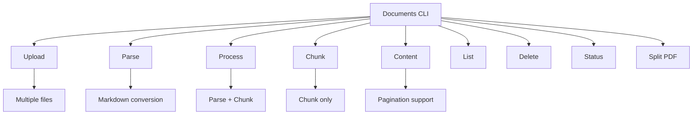

# Documents Module CLI Usage Guide

The Compileo Documents CLI provides comprehensive command-line tools for document management, including upload, parsing, processing, and content retrieval. This guide covers all available CLI commands with examples and best practices.

## Command Overview



---

## Document Upload

Upload one or more documents to a project:

```bash
compileo documents upload --project-id 1 document1.pdf document2.docx document3.txt
```

**Parameters:**
- `--project-id`: Project ID to upload documents to (required)
- `file_paths`: One or more document file paths (required)

**Supported Formats:** PDF, DOCX, TXT, MD, CSV, JSON, XML

**Example Output:**
```
📤 Uploading 3 documents to project 1...
✅ Documents uploaded successfully. Job ID: doc_upload_12345
📊 Files uploaded: 3
✅ Upload completed. 3 documents processed.
```

---

## Document Parsing

Parse documents to markdown format without chunking:

```bash
compileo documents parse --project-id 1 --document-ids 101,102,103 --parser gemini
```

**Parameters:**
- `--project-id`: Project ID containing documents (required)
- `--document-ids`: Comma-separated list of document IDs (required)
- `--parser`: Parser type (`gemini`, `grok`, `ollama`, `pypdf`, `unstructured`, `huggingface`, `novlm`)

**Example Output:**
```
📄 Parsing 3 documents in project 1 with gemini
✅ Parsing started. Job ID: parse_job_12345
⏳ Waiting for parsing completion...
✅ Parsing completed successfully!
📊 Results: 3 documents parsed to markdown
```

---

## Document Processing

Process documents with both parsing and chunking in a single operation:

```bash
compileo documents process --project-id 1 --document-ids 101,102 --parser gemini --chunk-strategy character --character-chunk-size 500 --character-overlap 50
```

**Parameters:**
- `--project-id`: Project ID containing documents (required)
- `--document-ids`: Comma-separated list of document IDs (required)
- `--parser`: Parser type (default: `gemini`)
- `--chunk-strategy`: Chunking strategy (`token`, `character`, `semantic`, `delimiter`, `schema`)
- `--chunk-size`: Chunk size (default: 512)
- `--overlap`: Overlap between chunks (default: 50)
- `--skip-parsing`: Skip parsing if documents are already parsed

**Chunking Strategy Options:**
- **Character**: `--character-chunk-size`, `--character-overlap`
- **Semantic**: `--semantic-prompt`
- **Schema**: `--schema-definition`
- **Delimiter**: Custom delimiter splitting

**Example Output:**
```
⚙️ Processing 2 documents in project 1
🔍 Parser: gemini
✂️ Chunk Strategy: character
✅ Processing started. Job ID: process_job_12345
⏳ Waiting for processing completion...
✅ Processing completed successfully!
📊 Results: 2 documents processed, 15 chunks created
```

---

## Separate Chunking

Chunk already parsed documents using specific chunking strategies:

```bash
compileo documents chunk --project-id 1 --document-ids 101,102 --chunk-strategy semantic --semantic-prompt "Split at natural topic boundaries..."
```

**Parameters:** Same as process command but focused on chunking only.

---

## Content Viewing

View parsed document content with pagination support:

```bash
compileo documents content 101 --page 1 --page-size 3000
```

**Parameters:**
- `document_id`: Document ID to view (required)
- `--page`: Page number (default: 1)
- `--page-size`: Characters per page (default: 3000)
- `--output`: Save content to file instead of displaying

**Example Output:**
```
Document 101 - Page 1 of 5
Total: 14,258 characters, 2,350 words, 280 lines
[Content displayed here...]

Page 1 of 5
Next: compileo documents content 101 --page 2
```

---

## Document Management

### List Documents

View documents in a project:

```bash
# List all documents in project
compileo documents list --project-id 1

# JSON format output
compileo documents list --project-id 1 --format json
```

**Parameters:**
- `--project-id`: Filter by project ID
- `--format`: Output format (`table`, `json`)

### Delete Documents

Remove documents and associated chunks:

```bash
# Delete with confirmation prompt
compileo documents delete 101

# Delete without confirmation
compileo documents delete 102 --confirm
```

---

## Job Status Monitoring

Check the status of upload, parsing, or processing jobs:

```bash
# Check upload status
compileo documents status --job-id doc_upload_12345 --type upload

# Check processing status
compileo documents status --job-id process_job_12345 --type process
```

**Parameters:**
- `--job-id`: Job ID to check (required)
- `--type`: Job type (`upload`, `process`, `parse`)

**Example Output:**
```
Job Status: COMPLETED
Progress: 100%
Current Step: Processing complete
Documents Processed: 2
Total Chunks Created: 15
```

---

## PDF Preprocessing

Split large PDFs into smaller chunks for better processing:

```bash
compileo documents split-pdf large_document.pdf --pages-per-split 200 --overlap-pages 1
```

**Parameters:**
- `pdf_path`: Path to PDF file (required)
- `--pages-per-split`: Pages per split (default: 200)
- `--overlap-pages`: Overlapping pages between splits (default: 1)

---

## Single File Processing

Process individual files directly without pre-uploading:

```bash
compileo process document.pdf --project-id 1 --parser gemini --chunk-strategy character --character-chunk-size 500
```

**Note:** This command combines upload, parsing, and chunking into a single operation.

---

## Batch Processing Examples

### Automated Document Pipeline

```bash
#!/bin/bash
# Complete document processing pipeline

PROJECT_ID=1
INPUT_DIR="./documents"

echo "🚀 Starting automated document processing..."

# Upload all documents
echo "📤 Uploading documents..."
JOB_ID=$(compileo documents upload --project-id $PROJECT_ID $INPUT_DIR/*.* | grep "Job ID:" | cut -d' ' -f4)

# Wait for upload completion
echo "⏳ Waiting for upload..."
while true; do
    STATUS=$(compileo documents status --job-id $JOB_ID --type upload | grep "Status:" | cut -d' ' -f3)
    if [ "$STATUS" = "COMPLETED" ]; then
        break
    fi
    sleep 2
done

# Get document IDs
echo "📋 Getting document IDs..."
DOC_IDS=$(compileo documents list --project-id $PROJECT_ID --format json | jq -r '.documents[].id' | tr '\n' ',' | sed 's/,$//')

if [ -z "$DOC_IDS" ]; then
    echo "❌ No documents found"
    exit 1
fi

echo "📄 Processing documents: $DOC_IDS"

# Process with semantic chunking
compileo documents process \
    --project-id $PROJECT_ID \
    --document-ids $DOC_IDS \
    --parser gemini \
    --chunk-strategy semantic \
    --semantic-prompt "Split this document at natural section boundaries, ensuring each chunk contains complete information."

echo "✅ Pipeline completed successfully!"
```

### Quality Assurance Workflow

```bash
#!/bin/bash
# Quality assurance document processing

PROJECT_ID=2

# Process with different strategies for comparison
echo "🔬 Running quality assurance tests..."

# Strategy 1: Character-based
compileo documents process \
    --project-id $PROJECT_ID \
    --document-ids 201,202 \
    --chunk-strategy character \
    --character-chunk-size 500 \
    --character-overlap 50

# Strategy 2: Semantic-based
compileo documents process \
    --project-id $PROJECT_ID \
    --document-ids 203,204 \
    --chunk-strategy semantic \
    --semantic-prompt "Split at meaningful topic boundaries."

# Compare results
echo "📊 Comparison complete. Check results in the GUI."
```

---

## Performance Optimization

### Large Document Sets

```bash
# Use character chunking for speed
compileo documents process \
    --project-id 1 \
    --document-ids 101,102,103,104,105 \
    --chunk-strategy character \
    --character-chunk-size 1000 \
    --character-overlap 100

# Process in smaller batches
compileo documents process --project-id 1 --document-ids 101,102 --chunk-strategy semantic --semantic-prompt "..."
compileo documents process --project-id 1 --document-ids 103,104 --chunk-strategy semantic --semantic-prompt "..."
```

### Memory Management

```bash
# Smaller chunks for memory-constrained environments
compileo documents process \
    --project-id 1 \
    --document-ids 101 \
    --chunk-strategy character \
    --character-chunk-size 256 \
    --character-overlap 25

# Use efficient parsers
compileo documents process \
    --project-id 1 \
    --document-ids 101 \
    --parser pypdf \
    --chunk-strategy character \
    --character-chunk-size 500
```

---

## Error Handling

### Common Issues

**Invalid Document IDs:**
```bash
# Error: Document IDs not found
compileo documents process --project-id 1 --document-ids 999
# Solution: Check available documents
compileo documents list --project-id 1
```

**Unsupported File Types:**
```bash
# Error: Unsupported file type
compileo documents upload --project-id 1 document.exe
# Solution: Use supported formats (PDF, DOCX, TXT, MD, CSV, JSON, XML)
```

**API Key Issues:**
```bash
# Error: AI service authentication failed
compileo documents process --project-id 1 --document-ids 101 --parser gemini
# Solution: Ensure API keys are configured in settings
```

**Large File Processing:**
```bash
# For very large PDFs, split first
compileo documents split-pdf large_document.pdf --pages-per-split 100
# Then process individual splits
```

---

## Integration with Scripts

### Python Automation

```python
import subprocess
import json
import time

def process_documents_batch(project_id, file_paths, chunk_strategy="character", **kwargs):
    """Process a batch of documents with error handling."""

    # Upload files
    upload_cmd = ["compileo", "documents", "upload", "--project-id", str(project_id)] + file_paths
    upload_result = subprocess.run(upload_cmd, capture_output=True, text=True)

    if upload_result.returncode != 0:
        raise Exception(f"Upload failed: {upload_result.stderr}")

    # Extract job ID from output
    job_id = None
    for line in upload_result.stdout.split('\n'):
        if "Job ID:" in line:
            job_id = line.split("Job ID:")[1].strip()
            break

    if not job_id:
        raise Exception("Could not extract job ID from upload output")

    # Wait for upload completion
    while True:
        status_cmd = ["compileo", "documents", "status", "--job-id", job_id, "--type", "upload"]
        status_result = subprocess.run(status_cmd, capture_output=True, text=True)

        if "COMPLETED" in status_result.stdout:
            break
        elif "FAILED" in status_result.stdout:
            raise Exception("Upload job failed")

        time.sleep(2)

    # Get document IDs
    list_cmd = ["compileo", "documents", "list", "--project-id", str(project_id), "--format", "json"]
    list_result = subprocess.run(list_cmd, capture_output=True, text=True)

    documents = json.loads(list_result.stdout)["documents"]
    doc_ids = [str(doc["id"]) for doc in documents]

    # Process documents
    process_cmd = [
        "compileo", "documents", "process",
        "--project-id", str(project_id),
        "--document-ids", ",".join(doc_ids),
        "--chunk-strategy", chunk_strategy
    ]

    # Add strategy-specific parameters
    if chunk_strategy == "character":
        process_cmd.extend([
            "--character-chunk-size", str(kwargs.get("chunk_size", 500)),
            "--character-overlap", str(kwargs.get("overlap", 50))
        ])
    elif chunk_strategy == "semantic":
        process_cmd.extend([
            "--semantic-prompt", kwargs.get("prompt", "Split at natural boundaries.")
        ])

    process_result = subprocess.run(process_cmd, capture_output=True, text=True)

    if process_result.returncode != 0:
        raise Exception(f"Processing failed: {process_result.stderr}")

    return process_result.stdout

# Usage
try:
    result = process_documents_batch(
        project_id=1,
        file_paths=["doc1.pdf", "doc2.pdf"],
        chunk_strategy="semantic",
        prompt="Split at chapter boundaries."
    )
    print("Processing completed successfully!")
    print(result)
except Exception as e:
    print(f"Error: {e}")
```

### Monitoring and Logging

```python
import logging
import subprocess
import time

logging.basicConfig(level=logging.INFO)
logger = logging.getLogger(__name__)

def monitor_job_completion(job_id, job_type="process", timeout=300):
    """Monitor job completion with logging."""

    start_time = time.time()
    last_progress = 0

    while time.time() - start_time < timeout:
        try:
            cmd = ["compileo", "documents", "status", "--job-id", job_id, "--type", job_type]
            result = subprocess.run(cmd, capture_output=True, text=True, timeout=30)

            if result.returncode != 0:
                logger.error(f"Status check failed: {result.stderr}")
                continue

            output = result.stdout

            # Extract progress
            progress = 0
            if "Progress:" in output:
                progress_line = [line for line in output.split('\n') if "Progress:" in line]
                if progress_line:
                    progress = int(progress_line[0].split("Progress:")[1].split("%")[0].strip())

            # Log progress changes
            if progress != last_progress:
                logger.info(f"Job {job_id}: {progress}% complete")
                last_progress = progress

            # Check completion
            if "COMPLETED" in output:
                logger.info(f"Job {job_id} completed successfully!")
                return True
            elif "FAILED" in output:
                logger.error(f"Job {job_id} failed!")
                return False

        except subprocess.TimeoutExpired:
            logger.warning(f"Status check timed out for job {job_id}")
        except Exception as e:
            logger.error(f"Error monitoring job {job_id}: {e}")

        time.sleep(5)

    logger.warning(f"Job {job_id} monitoring timed out after {timeout} seconds")
    return False

# Usage
job_id = "process_job_12345"
if monitor_job_completion(job_id):
    print("Job completed successfully!")
else:
    print("Job failed or timed out")
```

This CLI provides comprehensive document processing capabilities with support for multiple parsing options, chunking strategies, and batch operations suitable for both interactive use and automated workflows.