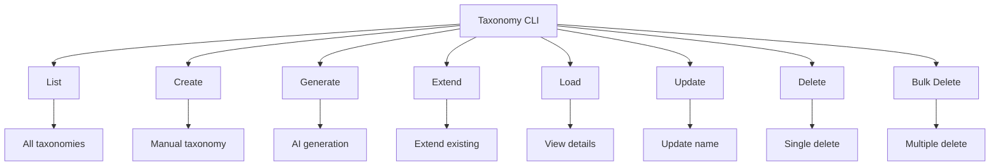

# Taxonomy Module CLI Usage Guide

The Compileo Taxonomy CLI provides comprehensive command-line tools for taxonomy management, including creation, generation, extension, and retrieval. This guide covers all available CLI commands with examples and best practices.

## Command Overview



---

## Taxonomy Listing

List all available taxonomies with optional project filtering:

```bash
compileo taxonomy list --project-id 1 --format table
```

**Parameters:**
- `--project-id`: Filter by project ID (optional)
- `--format`: Output format (`table`, `json`) (default: `table`)

**Example Output:**
```
📋 Taxonomies in project 1:
┌────┬─────────────────────┬─────────────────────────────────┬─────────────┬─────────────────┐
│ ID │ Name                │ Description                     │ Categories  │ Confidence      │
├────┼─────────────────────┼─────────────────────────────────┼─────────────┼─────────────────┤
│ 101│ Medical Conditions  │ Classification of conditions    │ 45          │ 0.85            │
│ 102│ AI Generated        │ AI-generated taxonomy           │ 78          │ 0.82            │
└────┴─────────────────────┴─────────────────────────────────┴─────────────┴─────────────────┘
```

---

## Manual Taxonomy Creation

Create a new taxonomy from a JSON file:

```bash
compileo taxonomy create --project-id 1 --name "Medical Conditions" --description "Classification system" --file taxonomy.json
```

**Parameters:**
- `--project-id`: Project ID for the taxonomy (required)
- `--name`: Taxonomy name (required)
- `--description`: Taxonomy description (optional)
- `--file`: JSON file containing taxonomy structure (optional)

**Taxonomy JSON Structure:**
```json
{
  "name": "Medical Conditions",
  "description": "Hierarchical classification",
  "children": [
    {
      "name": "Cardiovascular",
      "description": "Heart conditions",
      "confidence_threshold": 0.8,
      "children": [
        {
          "name": "Coronary Artery Disease",
          "description": "Artery blockage",
          "confidence_threshold": 0.85,
          "children": []
        }
      ]
    }
  ]
}
```

**Example Output:**
```
✅ Taxonomy created successfully!
📊 Taxonomy ID: 101
📂 File: storage/taxonomy/1/manual_taxonomy_uuid.json
🏷️ Categories: 3
🎯 Confidence: 0.8
```

---

## AI Taxonomy Generation

Generate a new taxonomy using AI from document chunks:

```bash
compileo taxonomy generate --project-id 1 --name "AI Medical Taxonomy" --documents 101,102,103 --depth 3 --generator gemini --domain medical --batch-size 10 --category-limits 5,10,15 --specificity-level 2
```

**Parameters:**
- `--project-id`: Project containing documents (required)
- `--name`: Taxonomy name (required)
- `--documents`: Comma-separated document IDs (required)
- `--depth`: Taxonomy hierarchy depth (default: 3)
- `--generator`: AI model (`gemini`, `grok`, `ollama`, `openai`) (default: `gemini`)
- `--domain`: Content domain (default: `general`)
- `--batch-size`: Number of complete chunks to process (default: 10)
- `--category-limits`: Max categories per level (comma-separated)
- `--specificity-level`: Specificity level 1-5 (default: 1)

**Example Output:**
```
🤖 Generating taxonomy with gemini...
📄 Analyzing 3 documents (100 chunks)
🎯 Domain: medical, Depth: 3
⏳ Generation in progress...
✅ Taxonomy generated successfully!
📊 Taxonomy ID: 102
🏷️ Categories: 45
🎯 Confidence: 0.85
📂 File: storage/taxonomy/1/ai_taxonomy_uuid.json
```

---

## Taxonomy Extension

Extend an existing taxonomy with additional hierarchy levels:

```bash
compileo taxonomy extend --taxonomy-data taxonomy.json --project-id 1 --additional-depth 2 --generator gemini --domain medical --batch-size 10
```

**Parameters:**
- `--taxonomy-data`: JSON file with taxonomy/category data (optional)
- `--project-id`: Project ID (required if using taxonomy-data)
- `--additional-depth`: Levels to add (default: 2)
- `--generator`: AI model (default: `gemini`)
- `--domain`: Content domain (default: `general`)
- `--batch-size`: Number of complete chunks to process (optional)
- `--documents`: Comma-separated list of document IDs to analyze (optional)
- `--processing-mode`: Processing mode (`fast` or `complete`) (default: `fast`)
  - `fast`: Quick processing with sampling (default)
  - `complete`: Comprehensive processing of all content

**Alternative: Extend by taxonomy ID**
```bash
compileo taxonomy extend --taxonomy-id 102 --additional-depth 1 --generator gemini
```

**Example Output:**
```
🚀 Extending taxonomy 102...
📈 Adding 1 additional level
⏳ Extension in progress...
✅ Taxonomy extended successfully!
📊 New categories: 78 (was 45)
🎯 Updated confidence: 0.82
```

---

## Taxonomy Viewing

Load detailed information about a specific taxonomy:

```bash
compileo taxonomy load 101 --format json --output taxonomy_backup.json
```

**Parameters:**
- `taxonomy_id`: Taxonomy ID to load (required)
- `--format`: Output format (`json`, `text`) (default: `json`)
- `--output`: Save to file instead of displaying (optional)

**Example Output:**
```json
{
  "taxonomy": {
    "name": "Medical Conditions",
    "description": "Classification system",
    "children": [...]
  },
  "metadata": {
    "type": "manual",
    "confidence_score": 0.8,
    "created_manually": true
  },
  "analytics": {
    "depth_analysis": {
      "total_categories": 45,
      "max_depth": 3
    }
  }
}
```

---

## Taxonomy Management

### Update Taxonomy

Update taxonomy information:

```bash
compileo taxonomy update 101 --name "Updated Medical Conditions"
```

**Parameters:**
- `taxonomy_id`: Taxonomy ID to update (required)
- `--name`: New taxonomy name (required)

### Delete Taxonomy

Remove a taxonomy. This operation performs a **complete cleanup**, removing the taxonomy's file from the filesystem and deleting all associated extraction jobs and their results (both database entries and filesystem files).

```bash
compileo taxonomy delete 101 --confirm
```

**Parameters:**
- `taxonomy_id`: Taxonomy ID to delete (required)
- `--confirm`: Skip confirmation prompt (flag)

### Bulk Delete Taxonomies

Delete multiple taxonomies at once. This operation performs a **complete cleanup** for all specified taxonomies, removing their files from the filesystem and deleting all associated extraction jobs and their results (both database entries and filesystem files).

```bash
compileo taxonomy bulk-delete --taxonomy-ids 101,102,103 --confirm
```

**Parameters:**
- `--taxonomy-ids`: Comma-separated taxonomy IDs (required)
- `--confirm`: Skip confirmation prompt (flag)

---

## Advanced Usage Examples

### Complete Taxonomy Workflow

```bash
#!/bin/bash
# Complete taxonomy creation and management workflow

PROJECT_ID=1
DOC_IDS="101,102,103"

echo "🚀 Starting taxonomy workflow..."

# 1. Generate AI taxonomy
echo "🤖 Generating AI taxonomy..."
compileo taxonomy generate \
    --project-id $PROJECT_ID \
    --name "Medical Knowledge Base" \
    --documents $DOC_IDS \
    --depth 3 \
    --generator gemini \
    --domain medical \
    --batch-size 10 \
    --category-limits 5,10,15

# 2. Extend with additional depth
echo "📈 Extending taxonomy..."
compileo taxonomy extend \
    --taxonomy-id $(compileo taxonomy list --project-id $PROJECT_ID --format json | jq -r '.taxonomies[0].id') \
    --additional-depth 1 \
    --generator gemini

# 3. Backup taxonomy
echo "💾 Creating backup..."
compileo taxonomy load $(compileo taxonomy list --project-id $PROJECT_ID --format json | jq -r '.taxonomies[0].id') \
    --output medical_taxonomy_backup.json

echo "✅ Taxonomy workflow completed!"
```

### Batch Taxonomy Generation

```bash
#!/bin/bash
# Generate taxonomies for multiple domains

PROJECT_ID=1
DOMAINS=("medical" "legal" "technical")
DOC_IDS="101,102,103,104,105"

for domain in "${DOMAINS[@]}"; do
    echo "🏗️ Generating $domain taxonomy..."
    compileo taxonomy generate \
        --project-id $PROJECT_ID \
        --name "${domain^} Classification" \
        --documents $DOC_IDS \
        --depth 3 \
        --generator gemini \
        --domain $domain \
        --batch-size 10 \
        --category-limits 5,8,12
done

echo "📊 Generated taxonomies for: ${DOMAINS[*]}"
```

### Taxonomy Quality Assessment

```bash
#!/bin/bash
# Assess taxonomy quality and cleanup

PROJECT_ID=1

echo "🔍 Assessing taxonomy quality..."

# List all taxonomies with confidence scores
compileo taxonomy list --project-id $PROJECT_ID --format json | jq -r '.taxonomies[] | "\(.id): \(.name) - Confidence: \(.confidence_score)"'

# Remove low-confidence taxonomies
LOW_CONFIDENCE=$(compileo taxonomy list --project-id $PROJECT_ID --format json | jq -r '.taxonomies[] | select(.confidence_score < 0.7) | .id' | tr '\n' ',' | sed 's/,$//')

if [ ! -z "$LOW_CONFIDENCE" ]; then
    echo "🗑️ Removing low-confidence taxonomies: $LOW_CONFIDENCE"
    compileo taxonomy bulk-delete --taxonomy-ids $LOW_CONFIDENCE --confirm
fi

echo "✅ Quality assessment completed!"
```

---

## Integration with Scripts

### Python Automation

```python
import subprocess
import json
import time

def create_taxonomy_workflow(project_id, document_ids, name, domain="general"):
    """Complete taxonomy creation workflow."""

    # Generate AI taxonomy
    cmd = [
        "compileo", "taxonomy", "generate",
        "--project-id", str(project_id),
        "--name", name,
        "--documents", ",".join(map(str, document_ids)),
        "--depth", "3",
        "--generator", "gemini",
        "--domain", domain,
        "--sample-size", "100"
    ]

    result = subprocess.run(cmd, capture_output=True, text=True)
    if result.returncode != 0:
        raise Exception(f"Taxonomy generation failed: {result.stderr}")

    # Extract taxonomy ID from output
    # (Implementation would parse the output to get taxonomy ID)

    # Extend taxonomy
    extend_cmd = [
        "compileo", "taxonomy", "extend",
        "--taxonomy-id", "102",  # Would be extracted from generation output
        "--additional-depth", "1",
        "--generator", "gemini"
    ]

    extend_result = subprocess.run(extend_cmd, capture_output=True, text=True)
    if extend_result.returncode != 0:
        raise Exception(f"Taxonomy extension failed: {extend_result.stderr}")

    return True

# Usage
try:
    success = create_taxonomy_workflow(
        project_id=1,
        document_ids=[101, 102, 103],
        name="Medical Taxonomy",
        domain="medical"
    )
    if success:
        print("Taxonomy workflow completed successfully!")
except Exception as e:
    print(f"Error: {e}")
```

### Taxonomy Comparison Script

```python
import subprocess
import json

def compare_taxonomies(project_id, taxonomy_ids):
    """Compare multiple taxonomies."""

    taxonomies = {}

    for tax_id in taxonomy_ids:
        # Load taxonomy details
        cmd = ["compileo", "taxonomy", "load", str(tax_id), "--format", "json"]
        result = subprocess.run(cmd, capture_output=True, text=True)

        if result.returncode == 0:
            tax_data = json.loads(result.stdout)
            taxonomies[tax_id] = {
                'name': tax_data['taxonomy']['name'],
                'categories': tax_data['analytics']['depth_analysis']['total_categories'],
                'depth': tax_data['analytics']['depth_analysis']['max_depth'],
                'confidence': tax_data['metadata']['confidence_score']
            }

    # Print comparison
    print("📊 Taxonomy Comparison:")
    print("-" * 60)
    for tax_id, data in taxonomies.items():
        print(f"ID {tax_id}: {data['name']}")
        print(f"  Categories: {data['categories']}, Depth: {data['depth']}, Confidence: {data['confidence']}")
        print()

# Usage
compare_taxonomies(1, [101, 102, 103])
```

---

## Best Practices

### Taxonomy Generation

**Document Selection:**
- Choose documents with diverse content for better taxonomy coverage
- Ensure documents are parsed before taxonomy generation
- Use representative samples (100-200 chunks) for optimal results

**Parameter Optimization:**
```bash
# Medical domain taxonomy
compileo taxonomy generate \
    --project-id 1 \
    --documents 101,102,103 \
    --depth 3 \
    --domain medical \
    --category-limits 5,10,15 \
    --specificity-level 2

# Technical documentation
compileo taxonomy generate \
    --project-id 1 \
    --documents 201,202 \
    --depth 4 \
    --domain technical \
    --category-limits 3,8,12,20 \
    --specificity-level 1
```

### Taxonomy Extension

**Incremental Growth:**
```bash
# Add one level at a time for better control
compileo taxonomy extend --taxonomy-id 101 --additional-depth 1 --generator gemini

# Use domain-specific extension with selected documents
compileo taxonomy extend --taxonomy-id 101 --additional-depth 2 --domain medical --generator gemini --documents 101,102
```

### Quality Management

**Regular Assessment:**
```bash
# Check taxonomy health
compileo taxonomy list --project-id 1 --format json | jq '.taxonomies[] | select(.confidence_score < 0.8)'

# Archive old taxonomies
compileo taxonomy bulk-delete --taxonomy-ids $(compileo taxonomy list --project-id 1 --format json | jq -r '.taxonomies[] | select(.created_at < "2024-01-01") | .id' | tr '\n' ',')
```

### Backup and Recovery

**Regular Backups:**
```bash
# Backup all taxonomies
for tax_id in $(compileo taxonomy list --project-id 1 --format json | jq -r '.taxonomies[].id'); do
    compileo taxonomy load $tax_id --output "backup_taxonomy_${tax_id}.json"
done

# Restore from backup
compileo taxonomy create --project-id 1 --file backup_taxonomy_101.json
```

---

## Error Handling

### Common Issues

**Missing Documents:**
```bash
# Error: No chunks found for selected documents
compileo taxonomy generate --project-id 1 --documents 999
# Solution: Check document IDs and ensure they are parsed
compileo documents list --project-id 1
```

**API Key Issues:**
```bash
# Error: API key not configured
compileo taxonomy generate --project-id 1 --documents 101 --generator gemini
# Solution: Ensure API keys are set in configuration
```

**Invalid JSON:**
```bash
# Error: Invalid taxonomy file format
compileo taxonomy create --project-id 1 --file invalid.json
# Solution: Validate JSON structure before use
```

**Permission Issues:**
```bash
# Error: Cannot write to taxonomy directory
compileo taxonomy generate --project-id 1 --documents 101
# Solution: Check file system permissions
```

---

## Performance Optimization

### Large Taxonomy Operations

```bash
# Use smaller sample sizes for faster generation
compileo taxonomy generate \
    --project-id 1 \
    --documents 101,102,103 \
    --batch-size 10 \
    --generator gemini

# Process taxonomies in batches
compileo taxonomy extend --taxonomy-id 101 --additional-depth 1 --sample-size 25
```

### Memory Management

```bash
# Limit concurrent operations
# Use appropriate chunk sizes for your system
compileo taxonomy generate \
    --project-id 1 \
    --documents 101 \
    --sample-size 50 \
    --category-limits 3,5,8
```

This CLI provides comprehensive taxonomy management capabilities with support for manual creation, AI generation, extension, and full lifecycle management suitable for both interactive use and automated workflows.